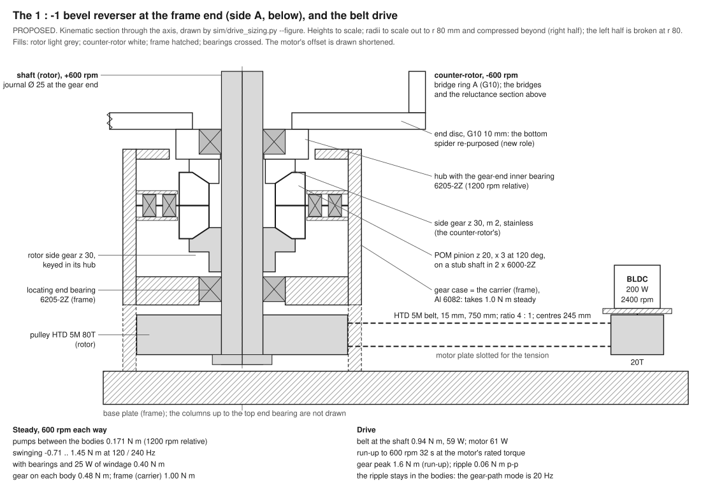

# The 1 : −1 reversing gear and the belt drive — concept and first-cut sizing

**Status:** PROPOSED (the designer accepts it). The locked design leaves the gear, the belt and the frame as cost-sheet
placeholders, "not designed or drawn" (`docs/ledger/DCCREG-design-ledger.md` line 196, §5.1).

**Source:** `sim/drive_sizing.py` → `sim/drive_sizing_results.json`. The kinematic sketch is
`docs/figures/drive-gear-concept.svg` (`python3 sim/drive_sizing.py --figure`). The script re-runs the magnetic pump's
deck in ngspice (about 25 s); `--no-spice` reuses the stored harmonics.

**Inputs.** Every number below that is not computed here comes from these records:

| input | value | source |
|:--|:--|:--|
| speed | 600 rpm each way, 1200 rpm relative, pumps at 120 Hz | `sim/pole-design-findings.md` §6; ledger line 87 |
| magnetic pump, belt power with the 22 mF bypass | 18.13 W | `sim/ah_steady_cusp_results.json` (C 22 mF) |
| magnetic pump, iron | 1.25 W (0.625 W a side) | `sim/pole_design_variants_op.json` (the pick's `P_fe_side_W`) |
| electrostatic pump, belt power | 2.14 W | `sim/core_field_results.json` (row `none`) |
| the pumps' instantaneous torque | the pick's deck, re-run; the one-revolution record | `sim/rotor_parts_duty.py`, `sim/ah_steady_cusp.py`; `sim/hub_revolution_results.json` |
| the machine in solids | 940 mm; end-bearing slots z 0–20 and 920–940; bridge ring A z 20–194 | `docs/geometry/tube/tube-r150-n6-air6-wound-g0p5-6br-hub50.parts.json` |
| utrons, bridges, bridge rings, carrier discs | every dimension of the pick | `sim/utron_profile.py` `spec` on `sim/pole_design_variants_op.json` |
| vanes and plates (3 mm, 6 + 6, both sides) | rotor vanes 2.87 kg, Ca / Cb 6.11 kg (rotor), stator vanes 3.38 kg | `sim/air_stack_sizing_results.json` (`thick_vanes.compare`) |
| shaft, bearings, spiders, cage | Ø 25 (tube) / Ø 30 (register), OPEN; 6205-class 25 / 52 / 15; G10 spiders 8 mm; cage r 162–166 | `sim/stack_sizing.py`; `presets/hub-locked.json`; `sim/tube_geometry.py` |
| the hub | vessel, PEEK retainer, G10 coupler, AH, flanges at ±72–80 mm | `presets/hub-locked.json` |
| La / Lb first-cut chokes | 1.41 kg each | `sim/rotor_parts_duty_results.json` (`la_core`, τ 0.5 s) |
| the shaft check of record | two bodies; a bearing proposed at each bridge ring's outer end | `sim/tube-shaft-findings.md` §0 |
| the placeholders | gear 250, drive 250, frame 300 EUR | `docs/make_cost_sheet.py` lines 411–413 |

## The recommendation

**A bevel reverser at the frame end, side A (below)** [IR]. It is the classic differential with its carrier held by the
frame.
- **Two identical side gears:** z 30, m 2, 12 mm face, austenitic stainless 1.4305 (non-magnetic, like the shaft).
  - The rotor's is keyed in its hub on the shaft's Ø 25 journal.
  - The counter-rotor's is bolted under a hub. The hub runs on the shaft through a **gear-end inner bearing**
    (6205-2Z) and hangs from a G10 end disc bolted to bridge ring A.
- **Three POM-C pinions,** z 20, on radial stub shafts at 120°. Each runs in a cartridge of two 6000-2Z in the gear case.
- **The gear case** (Al 6082) is the carrier. It is also the frame's bottom end-bearing housing: it holds the shaft's
  locating 6205-2Z in its floor.
- **The belt drives the shaft below the case:** HTD 5M, 15 mm, 20T → 80T (4 : 1), from a 200 W brushless motor at
  2400 rpm. The driver has a speed loop, ramps and a current limit at 1.5 × rated.

**The numbers** (with a 25 W windage allowance, see §4.1):

| quantity | value |
|:--|:--|
| the pumps' torque between the bodies | **0.171 N·m** mean at 1200 rpm relative; −0.71 to +1.45 N·m instantaneous |
| with the bearings and the windage allowance | 0.40 N·m relative |
| the gear's torque on each body; on the frame | **0.48 N·m** (counter-rotor) / 0.52 N·m (rotor); **1.00 N·m** into the case |
| the belt at the shaft | **0.94 N·m, 59 W**; motor 61 W at the shaft, 76 W electrical |
| run-up from rest to 600 rpm each way | **32 s** at the motor's rated torque; the gear's peak 1.6 N·m |
| at the driver's current limit | the gear 2.5 N·m accelerating, 2.8 N·m braking |
| the pumps' 120 / 240 Hz pulsation at the gear | **0.061 N·m p-p** around 0.48 N·m: the flanks never unload |
| the POM pinion | bending 2.4 MPa, contact 13 MPa steady (S 5.7 / 2.7); 12 / 30 MPa at the limit (S 3.6 / 2.0) |
| envelope at the frame end | 156 mm below the record's end-bearing slot; case Ø 144 mm; the machine stands 1.12 m on its base |
| bill of parts | **1,066 EUR** (gear 411, drive 340, frame 315) against the sheet's 800; an economy build 703 |

**Why this one:**
- **Exact 1 : −1 in one stage** [OC]: two equal side gears and a held carrier. Three pinions balance the mesh forces, so
  neither body gets a side load from the gear.
- **The gear is sized by the shaft, not by the load.** m 2 is the smallest module whose side gear takes a Ø 25 journal.
  At these torques, even in POM, it keeps a bending margin of 3.6–6 and a contact margin of 2–2.7 (§5).
- **It keeps the pumps' pulsation out of the frame.** With POM pinions the drive train's gear mode is 20 Hz, far below
  120 Hz. The bodies' own inertia absorbs the pulsation, and the gear sees 6 % of its mean as ripple (§4.2).
- **Its hub bearing is a bearing the record already wants.** `sim/tube-shaft-findings.md` §0 finds the six bearings as
  laid out too soft (f1 29 Hz at Ø 25) and proposes one between the shaft and each bridge ring's outer end (165 Hz).
  The gear-end inner bearing is the bottom one of that pair.
- **Quiet, greased (no oil bath) and insulating** [IR]: the POM-on-stainless meshes run in grease, and the polymer
  pinions keep the gear from making a stray path between REF (the shaft) and the earthed frame.

## 1. What the drive must carry

**The torque balance** [OC].
- The pumps act between the bodies: −T on the rotor and +T on the counter-rotor. Their power is P = T·ω_rel, with
  ω_rel = 125.7 rad/s at 1200 rpm relative.
- Each body turns at 600 rpm against the frame (62.8 rad/s), so each sees the same T at half the speed: half the
  power each.
- A lossless 1 : −1 gear whose carrier is fixed satisfies τ_r·ω + τ_c·(−ω) = 0. So it applies **the same torque τ to
  both bodies**, and the carrier takes −2τ.
- Steady state:
  - the counter-rotor needs τ = T_rel + D_c from the gear, in its own direction of turning;
  - the rotor then carries the same τ back through its side gear;
  - the belt supplies T_belt = 2·T_rel + D_r + D_c at 600 rpm (plus the gear's losses);
  - D_c and D_r are each body's own drag against the frame or the room.
- **The record's pumps:** 21.52 W is **0.171 N·m at 1200 rpm relative** (0.154 magnetic with iron, 0.017
  electrostatic), or 0.342 N·m at the belt's 600 rpm.
  - The earlier pump's 78 mN·m (`sim/spinup-findings.md` line 11) was a 20 kV electrostatic pump at 300 rpm
    relative.
- **Through a different drive** the same balance holds: two belts, or a pinion-driven gear, also put 2·T_rel + drags
  into the belt. Only the path of the reaction changes.

## 2. The concepts compared

| | (a) bevel reverser, carrier = frame | (b) star gear, stepped planets | (c) two belts, one reversed | (d1) two motors, phase-locked | (d2) spur layshaft + internal ring | (d3) friction bevel reverser |
|:--|:--|:--|:--|:--|:--|:--|
| 1 : −1 | exact, one stage [OC] | exact only if z_s·z_p2 = z_p1·z_r, e.g. sun 45 / planets 15 + 30 / ring 90 at m 1.5 [OC] | exact on average (equal tooth counts); elastic phase wobble | by control | exact if z1·z3 = z2·z4 | not exact: 0.5–3 % slip [RH] |
| axial at the end | 156 mm with the pulley and base (§8) | ~90 mm [RH] | ~110 mm: two belt planes [RH] | ~60 mm per body [RH] | ~80 mm [RH] | ~90 mm [RH] |
| Ø | 144 mm case | ~170 mm (ring Ø 135 + bell) | ~260 mm with the idlers | ~300 mm | ~220 mm | ~160 mm |
| side load on the bodies | none net (3 pinions); the belt pull into the locating bearing only | none net (3 planets) | ~90 N on the counter-rotor's overhung end, unless its pulley gets its own frame bearing | a hub load on each body | unbalanced, ~2 F_t on both bodies at the utron gap's end | none net |
| backlash, compliance | one stage, two meshes; does not matter to the pumps (§5) | two stages; the stepped planets must be timed | soft | none | two meshes | none |
| noise | low with POM pinions (mesh 300 Hz) | moderate: an internal gear, six meshes | low | low | moderate | very low |
| cost [RH] | 270–410 | 600–900 (an internal ring and stepped planets made one-off) | 300–400 | 550–700 (two drives + controller) | 400–600 | 200–300 |
| reaction into the frame | pinion cartridges → case → base: 2τ | planet pins → carrier: 2τ | two hub loads and the motor plate | each motor plate | layshaft bearings | roller axles |
| main risk | the side gears' axial setting (shims) | cost; the ring's bell must reach round the planets | the back-side drive of a double-sided belt, tooth jump in a run-up | departs from the decided single belt | side loads at the 0.5 mm gap | the split drifts; wear |

- **(a) wins** on exactness, the side loads and the cost [IR].
- **(b) is the compact coaxial alternative,** but with a fixed carrier a simple star cannot give −1 (its ring always
  outnumbers its sun). The stepped planets cost three bespoke parts and an internal gear.
- **(c) needs the counter-rotor to carry a pulley.** Its belt pull lands on the bridge ring's overhung end next to the
  0.5 mm utron gap, unless that pulley gets a frame bearing of its own. Reversing it needs a double-sided belt run on its
  back, with a short wrap.
- **A variant of (a)** drives one pinion's shaft (a single-input contra-rotating drive) [IR]. It takes the belt pull off
  the machine's shaft but puts a horizontal input through the case wall, and that pinion carries all the drive torque.
  It is not needed: the belt pull is reacted by the locating bearing beside it (§7).
- **Not in the table:** a contra-rotating motor between the bodies (no gear) needs slip rings and leaves the speed split
  to the drags; a coaxial magnetic gear would put stray fields near the AH null.

## 3. The bodies

Masses and polar inertias from the record's geometry [OC: geometry; IR: as modelled; RH: the lumps named]:

| rotor (+600 rpm) | kg | kg·m² | counter-rotor (−600 rpm) | kg | kg·m² |
|:--|--:|--:|:--|--:|--:|
| 6 wound utrons (2.233 kg each, r 57–130) | 13.40 | 0.136 | 12 bridges (r 130.5–144.5) | 7.85 | 0.149 |
| 12 Ca / Cb plates (r 50–150) | 6.11 | 0.076 | 2 G10 bridge rings (25 mm wall, as modelled) | 12.66 | **0.268** |
| 12 rotor vanes | 2.87 | 0.029 | 12 stator vanes | 3.38 | 0.056 |
| La / Lb, at r 90 [RH: not drawn] | 2.81 | 0.023 | G10 cage, 564 mm | 4.30 | 0.116 |
| electronics, wiring, potting [RH: 2 kg at r 100] | 2.00 | 0.020 | 4 G10 spiders (solid, as modelled) | 4.76 | 0.064 |
| shaft Ø 25 (stainless, 1092 mm), sleeve, discs, hub | 7.34 | 0.003 | end disc (G10 10 mm), hub, side gear (this design) | 1.92 | 0.018 |
| side gear and pulley (this design) | 0.80 | 0.001 | | | |
| **total** | **35.3** | **0.288** | **total** | **34.9** | **0.670** |

- **At 600 rpm each way** the bodies hold 1.89 kJ [OC].
- **The counter-rotor has 2.3 × the rotor's inertia,** 40 % of it in the G10 bridge rings [IR: as modelled].
  `sim/tube-shaft-findings.md` §0 notes those rings could be lighter.
- **Cross-check:** the record's solids give 33.4 and 33.1 kg (`sim/tube-shaft-findings.md` §0). The difference here is
  the [RH] lumps and this design's parts.

## 4. The torques

### 4.1 Steady, at 600 rpm each way

| term | acts | torque | power |
|:--|:--|--:|--:|
| the pumps (magnetic 18.13 + iron 1.25 + electrostatic 2.14 W) | between the bodies | 0.171 N·m | 21.5 W |
| five inner bearings (four of record + the gear-end one), SKF-class drag [IR] | between the bodies | 0.070 N·m | 8.7 W |
| windage inside the cage (80 % of the allowance) [RH] | between the bodies | 0.159 N·m | 20.0 W |
| **T_rel** | | **0.400 N·m** | |
| windage outside the cage, D_c (20 %) [RH] | counter-rotor vs room | 0.080 N·m | 5.0 W |
| two end bearings, D_r | rotor vs frame | 0.022 N·m | 1.4 W |
| the gear: two meshes at 0.97 and the pinions' bearings [IR] | | | 2.6 W |
| **the gear's torque on each body** | | **0.48 / 0.52 N·m** | |
| **the frame (the carrier)** | | **1.00 N·m** | |
| **the belt at the shaft** | | **0.94 N·m** | **59.2 W** |

- **The windage allowance is a stated margin** [RH]. 25 W is 2.8 × a crude estimate: the vanes as laminar enclosed
  discs, 6.7 W, and the cage's outside as a flat plate, 2.3 W (`windage_crosscheck` in the results). The separate
  windage estimate replaces it; the sizing is insensitive to it:

| windage at 600 rpm | 0 W | **25 W** | 50 W | 100 W |
|:--|--:|--:|--:|--:|
| the gear on each body | 0.24 N·m | **0.48** | 0.72 | 1.20 |
| the frame | 0.51 N·m | **1.00** | 1.49 | 2.48 |
| the belt at the shaft | 0.53 N·m, 33 W | **0.94 N·m, 59 W** | 1.36 N·m, 85 W | 2.18 N·m, 137 W |
| the motor's load, of rated | 21 % | **38 %** | 55 % | 88 % |
| run-up to 600 rpm | 30 s | **32 s** | 36 s | 52 s |

  Above about 100 W, take the 400 W motor of the same family [IR].
- **The bearings' drag is not in the pumps' power** [IR]: 10 W for seven greased 6205-2Z bearings at their speeds
  (f0 1.0, base oil 100 mm²/s). Contact seals (2RS) would add roughly as much again [RH], so the drive uses shields
  (2Z).

### 4.2 The pulsation: where 1.45 N·m goes

**What the pumps do within a cycle** [OC: the circuits of record].
- **The magnetic pump:** each utron group's torque swings −0.65 to +1.36 N·m around 0.072. Group A generates while
  group B motors, then they swap.
- **In the sum** the 120 Hz parts cancel. The total swings at **240 Hz** (0.67 N·m) and its even harmonics.
- **The difference A − B** (0.75 N·m at 120 Hz, 0.41 at 360 Hz) twists each body between its ends.
- **The electrostatic pump** adds ±0.04 N·m.
- **Together**, at the worst relative clocking of the two pumps (not documented; scanned), the torque between the bodies
  runs **−0.71 to +1.45 N·m around 0.171**. It reverses every cycle.

**Why the gear hardly sees it** [OC].
- A 1 : −1 gear only has to make the bodies' motions mirror each other. The pumps push the two bodies in opposite
  directions, which is the motion the gear allows anyway.
- **With equal inertias** a rigid gear would carry none of the pulsation. With 0.288 against 0.670 kg·m² it would
  carry (J_c − J_r)/(J_r + J_c) = 40 % of the sum, ±0.27 N·m at 240 Hz.
- **But the drive train is compliant.** Above its gear-path mode the bodies respond on their own inertia and the gear
  carries a share falling as (f_mode / f)².

**The torsional model** [IR]: seven inertias (the motor; each body's gear end, side A and side B). The springs:
- the belt;
- the shaft from the gear to side A, and from A to B through the hub (flanges, G10 coupler, PEEK: 3e4 N·m/rad [RH]);
- the end disc and bridge ring A;
- the cage (G10, G 5 GPa [RH]);
- the gear's mesh stiffness: ISO 6336-class c_γ 20 N/(mm·µm) × 0.85 for bevels, scaled by 2 E_POM / E_steel for a
  polymer member [IR].

All springs carry a loss factor of 0.03 [RH]. The solver is checked against the rigid limit: 0.401 against the closed
form's 0.399, and zero for equal inertias (`selfcheck_rigid_limit` in the results).

| | POM-C pinions (recommended) | stainless pinions |
|:--|--:|--:|
| mesh stiffness | 5.9 MN/m per mesh | 204 MN/m |
| the gear-path mode | **20 Hz** (55 % of its energy in the mesh) | 61 Hz (set by the shaft's torsion to side A) |
| the gear's ripple, p-p | **0.061 N·m** (±6 % of 0.48) | 0.20 N·m (±21 %) |
| flank reversal | none | none |
| the hub joint, p-p | 0.14 N·m | 0.14 N·m |
| the belt, p-p | 0.011 N·m | 0.039 N·m |
| into the frame, p-p | 0.12 N·m | 0.40 N·m |

- **The other modes** (POM case): the shaft's A–B twist at 49 Hz, the motor on the belt at 309 Hz, the cage's A–B
  twist at 380 Hz, the shaft from the gear to side A at 619 Hz, and the end disc at 935 Hz.
- **The cage's A–B twist sits near the A − B torque's 3rd harmonic (360 Hz)** [RH].
  - At G10's 5 GPa the cage twists 4.3 N·m p-p (1.7 at 3 GPa, 294 Hz; 1.4 at 10 GPa, 538 Hz).
  - That is a few kPa in the tube and about 4 µrad, so it is harmless as stress. It is a possible hum and a fatigue
    point at the spiders' bolted joints.
  - It is a property of the counter-rotor, not of the gear: the gear's ripple moves by about 10 % across it.
- **The run-up crosses the 20 Hz gear mode** at about 100 rpm, with only the electrostatic pump running (the magnetic
  pump is kicked at speed). At a 2 rad/s² ramp the crossing takes a fraction of a second against the mode's 1.6 s
  build-up. So kick the magnetic pump above about 200 rpm [IR].

### 4.3 The run-up and the limit

The driver ramps to 600 rpm each way. The belt carries the bodies' inertia and the drags; the motor's own inertia stays
on its side [IR]. All rows have both pumps on (conservative for the gear), except the electrostatic-only one.

| ramp | time | the gear's peak | the belt at the shaft | the motor's peak |
|:--|--:|--:|--:|--:|
| 30 s target, at the rated torque (the record) | **32.5 s** | **1.63 N·m** | 2.48 N·m | 0.64 N·m, 161 W |
| the same, the electrostatic pump only | 30.2 s | 1.65 N·m | 2.48 N·m | 0.64 N·m |
| soft, 60 s | 60 s | 1.18 N·m | 1.95 N·m | 0.50 N·m, 126 W |
| at the driver's limit, 1.5 × rated | 19.3 s | 2.52 N·m | 3.72 N·m | 0.96 N·m, 241 W |
| braking at the limit | | 2.78 N·m | | |

- **During acceleration the gear carries the counter-rotor's inertia share** [OC]: J_c / (J_r + J_c) = 70 % of the
  belt's accelerating torque, plus its steady torque.
- **The driver's current limit is the design's torque fuse** [IR]. 1.5 × rated keeps the belt within its
  catalogue-class rating and the gear within a factor 3.6 in bending.
- **A rub at the 0.5 mm gap is not limited by the driver.** It would lock the bodies against each other, and their
  1.89 kJ would load the gear. An optional slip hub under the counter-rotor's side gear, set near 6 N·m, protects the
  teeth and the bodies (80 EUR, not in the totals) [IR].

## 5. The gear

**Geometry** [OC: straight bevel, 90° shaft angle, equal addendum; mean-section virtual spur gear]:

| | side gears (×2) | pinions (×3) |
|:--|:--|:--|
| teeth, module, face | z 30, m 2, b 12 mm (b / R_e 0.33) | z 20, m 2, b 12 mm |
| pitch / tip diameter | 60 / 62.2 mm | 40 / 43.3 mm |
| pitch angle | 56.31° | 33.69° |
| cone distance R_e; mean module | 36.06 mm; 1.667 | the same |
| virtual teeth; contact ratio | 54.1 | 24.0; ε_α 1.69 |
| speed against the frame | 600 rpm | 900 rpm (on frame-fixed axes) |
| material | austenitic stainless 1.4305 | POM-C |

- **Assembly** [OC]: 2·z_s / N = 20 is a whole number, so three equally spaced pinions mesh both side gears.
- **The mesh frequency** is 300 Hz, between the pumps' 240 and 360 Hz harmonics [OC].
- **The side gear's rim:** the small-end root is Ø 38 mm against the Ø 25 journal. So the key sits in the gear's hub
  (Ø 40), not under the teeth. m 2 is the smallest module that leaves a rim at this bore [IR].

**Strength** [IR: Lewis bending and Hertz contact at the mean section, AGMA / ISO-class factors]:
- K_o 1.25, K_v 1.15 (AGMA Q 8 at 1.6 m/s), K_m 1.3, load sharing K_γ 1.2 over the three pinions.
- The pinion is an idler. Its teeth are loaded on opposite flanks at its two meshes, so its bending limit takes Y_M 0.7.
- POM-C limits: σ_F 20 MPa at 10⁹ cycles and 45 MPa short-term; σ_H 36 / 60 MPa (VDI 2736-class, ≤ 60 °C) [IR].
- Stainless limits: σ_F 120 / 250 MPa, σ_H 350 / 600 MPa [IR].

| case | torque on a side gear | F_t per mesh | POM pinion σ_F (S) | σ_H (S, POM) | stainless side gear S_F / S_H |
|:--|--:|--:|--:|--:|--:|
| steady + ripple, 10⁹ cycles | 0.55 N·m | 8.8 N | 2.4 MPa (5.7) | 13.1 MPa (2.75) | 42 / 27 |
| run-up peak | 1.63 N·m | 26.1 N | 7.2 MPa (6.2) | 22.5 MPa (2.66) | 42 / 27 |
| the driver's limit (braking) | 2.78 N·m | 44.5 N | 12.3 MPa (3.6) | 29.5 MPa (2.04) | 25 / 20 |

- **Wear and heat:** about 1 W of mesh loss across three greased POM-on-stainless meshes is negligible [RH].
- **The pinions' shafts and bearings** [OC: statics]:
  - an idler's two meshes push its axle the same way, 2·F_t: 17 N steady, 81 N at the limit;
  - its outward thrust is 3.4 / 16 N;
  - each stub shaft (Ø 10) runs in two 6000-2Z, 16 mm apart, the mesh 12 mm outboard [IR];
  - the inner bearing sees 29 N steady and 141 N at the limit, a static safety of 14. The stub shaft's bending stress
    is 9.9 MPa.
- **The side gears' thrust** [OC] pushes them apart along the axis: 7.6 N steady and 37 N at the limit, summed over the
  three pinions. Both side gears sit on the shaft (one through its bearing), so the shaft carries this between them as
  tension. It does not reach the frame.
- **Backlash:**
  - j_n 0.10–0.15 mm, set by shims under the pinion cartridges and a spacer under the rotor's side gear [IR].
  - The pumps do not see it [OC]: each pump's A / B phase is fixed inside the bodies (bridges and stator vanes on the
    counter-rotor, utrons and rotor vanes on the rotor). The gear only sets how the relative speed splits between the
    bodies.
  - POM's growth (10⁻⁴/K) eats about 0.05 mm of backlash over 30 K [OC]. POM swells little in humid air; PA would
    swell 2–3 % [IR].
- **Lubrication:** a POM-compatible grease in the closed case [IR]. Debris and grease fall away from the machine.
- **Non-magnetic, as the shaft** (`sim/tube-shaft-findings.md` §2) [IR].
  - The side gears sit 30–100 mm below the utrons' end turns (z 23), where the leakage is small [RH].
  - C45 stock gears (the economy line) would do mechanically.

**The counter-rotor's end** [IR].
- The G10 end disc (10 mm, r 30–156.5) takes the place of the record's bottom frame spider. It closes bridge ring A's
  overhang and carries the hub.
- The hub's 6205-2Z (1200 rpm relative) also **locates the counter-rotor axially**: it carries its weight, 350 N, and
  has an L10 of 172,000 h. The other inner bearings float axially.
- The hub and the side gear are a metal island at the shaft's potential. G10 separates them from the counter-rotor's
  REF parts, and POM from the frame. So the one wired reference link of record stays the only path
  (`sim/rotor-parts-duty-findings.md` §4).
- **The variant** [IR]: run the hub in the gear case instead of on the shaft. One housing would then set both side
  gears, and the counter-rotor would gain a frame support. That changes the record's "only the two end bearings face the
  frame". It is not needed if the bridge-ring bearings of `sim/tube-shaft-findings.md` §0 are adopted.

## 6. The belt and the motor

| item | value |
|:--|:--|
| motor | brushless DC, 200 W at 3000 rpm, 0.64 N·m rated, 48 V; a speed-loop driver with ramps and a 1.5 × current limit [IR, catalogue-class] |
| ratio and speed | 4 : 1; the motor at 2400 rpm for 600 rpm |
| pulleys | HTD 5M 20T (Ø 31.8 mm) on the motor, 80T (Ø 127.3 mm, taper bush) on the shaft below the case |
| belt | HTD 5M, 15 mm wide, 750 mm long (150 teeth); centres 245 mm; wrap on the 20T 158°, 8 teeth in mesh; 4.0 m/s |
| width check [IR: 0.5 N per mm per tooth in mesh, conservative for HTD 5M at 4 m/s; service factor 1.6] | 6.1 mm needed for the steady pull (15 N); 15.1 mm at the driver's limit (60 N): 15 mm |
| tension | 46 N static per strand, so the slack side stays tight at the limit; the tight side ≤ 76 N against 375 N allowable [IR] |
| hub load | 90 N static, 153 N at the limit, at the motor plate and into the locating end bearing |
| span | first transverse mode 61 Hz; tooth-mesh 800 Hz at the motor |
| time to speed | 32 s on the 30 s ramp; 19 s at the limit |
| the steady draw | 61 W at the motor's shaft (38 % of rated at 2400 rpm), 76 W electrical [IR: η 0.8] |

- **A 4-pole induction motor on a VFD** (0.25 kW, 24T / 56T) is the economy alternative. It is cheaper but loses the
  current-limit precision and the low-speed torque [IR].
- **The belt barely carries the pulsation:** 0.011 N·m p-p (§4.2) [IR]. The machine's inertia filters it.

## 7. The reaction torque's path, the frame's loads, and the bearings

**The path** [OC]:
- the pumps' torque → the counter-rotor → its side gear → the three pinions → their cartridges → the gear case → the
  base plate;
- the same torque returns from the pinions to the rotor's side gear, and the belt supplies both: at the motor plate
  the reaction is the belt pull and the motor's 0.24 N·m;
- the base plate carries the 1.0 N·m between the case and the motor plate. The frame's net torque on the floor is only
  the windage outside the cage (about 0.08 N·m with the allowance);
- the pulsation stays in the bodies: 0.12 N·m p-p reaches the frame through the gear (POM).

**The frame's loads** [IR: this design's numbers]:

| load | steady | run-up | at the limit |
|:--|--:|--:|--:|
| torque on the gear case, about the axis | 1.00 N·m | 3.4 N·m | 5.2 N·m |
| motor plate: the motor's reaction | 0.24 N·m | 0.64 N·m | 0.96 N·m |
| belt hub load, horizontal, at the pulley's height | 90 N | | 153 N |
| weight of both bodies on the locating bearing | 689 N | | |

**What the bearings see** [IR: catalogue 6205 C 14.8 kN, C0 7.8 kN; 6000 C 4.55 kN]:

| bearing | speed | loads | L10 |
|:--|:--|:--|--:|
| bottom end, locating (frame), 6205-2Z | 600 rpm | axial 689 N (both bodies), radial 96 N (the belt + unbalance) | 65,000 h |
| gear-end inner (new), 6205-2Z | 1200 rpm relative | axial 350 N (the counter-rotor), radial ~10 N | 172,000 h |
| four inner of record | 1200 rpm relative | no load from the drive; unbalance ~5 N (G 2.5) | |
| top end (frame), floating | 600 rpm | radial: its share of the unbalance; no axial | |
| pinion cartridges, 6000-2Z | 900 rpm | 29 N steady, 141 N at the limit | >10⁷ h |

- **The drive adds no side load to the inner bearings** [OC]: the three pinions' radial forces cancel.
- **The belt's pull goes into the locating bearing** [OC], 26.5 mm above the pulley's centre. It bends the Ø 25 journal by
  1.6 MPa (2.6 MPa at the limit).
- **The top end bearing floats** [IR]. The shaft's thermal growth (0.3 mm for 0.94 m of stainless over 20 K) goes up,
  away from the mesh [OC].

## 8. The envelope at the frame end — which end and why

**Side A, below** [IR]:
- **The base carries the weight.** The case is also the bottom end-bearing housing, so the gear, the locating bearing
  and the motor plate share one stiff plate.
- **The bevel mesh is set by axial positions.** The bottom bearing locates the shaft. With the gear beside it, the
  shaft's thermal growth goes to the floating top bearing, not into the mesh.
- **Grease and wear debris fall away from the machine,** not onto the HV stack or into the 0.5 mm utron gap.
- **The gear-end inner bearing is the bottom bridge-ring bearing** the shaft check proposes.

**The stack-up** [IR] (z from the record's bottom end-bearing slot, side A; the slot's 20 mm is reused):

| part | z (mm) |
|:--|:--|
| bridge ring A ends (counter-rotor) | 20 |
| end disc, G10 10 mm (the bottom spider re-purposed) | 10 – 20 |
| counter-rotor hub with the gear-end 6205-2Z | −8 – 10 |
| counter-rotor side gear | −24 – −8 |
| pinions on radial axes (apex plane z −36) | −58 – −14 |
| rotor side gear with its hub | −76 – −48 |
| case floor with the locating 6205-2Z | −96 – −79 |
| pulley 80T (24 mm over the flanges) | −126 – −102 |
| shaft end and nut | −132 – −126 |
| base plate, 20 mm | −156 – −136 |

- **Radially** the case is Ø 144 mm, inside bridge ring A's Ø 313. The pinion cartridges reach r 72 [IR].
- **The drive adds 156 mm below z 0.** The machine stands 1.12 m from the base plate's underside to its top plate.
- **The frame:** three columns from the base to the top plate, which carries the floating top end bearing, outside the
  cage's Ø 332 [IR].

## 9. Bill of parts (placeholders, one-off prototype, EUR) [RH]

| group | item | qty | unit | extended | economy |
|:--|:--|--:|--:|--:|--:|
| gear | side gears, stainless 1.4305, m 2, z 30 (the wheel of a 1.5 : 1 set), keyed in the hub / bolted | 2 | 45 | 90 | 50 (C45 stock) |
| gear | pinions, POM-C, m 2, z 20, pressed on stainless stub shafts | 3 | 20 | 60 | 36 |
| gear | pinion cartridges: stub shaft Ø 10, 2 × 6000-2Z, sleeve, shims | 3 | 18 | 54 | 45 |
| gear | gear case and bell, Al 6082, machined (it is the bottom end-bearing housing) | 1 | 140 | 140 | 80 (bolted plates) |
| gear | counter-rotor hub, Al 6082 | 1 | 35 | 35 | 30 |
| gear | gear-end inner bearing 6205-2Z | 1 | 12 | 12 | 12 |
| gear | grease, keys, circlips, fasteners | 1 | 20 | 20 | 15 |
| | **gear** (the sheet: 250) | | | **411** | **268** |
| drive | brushless motor 200 W with driver | 1 | 190 | 190 | 130 (induction + VFD) |
| drive | 48 V supply, 300 W | 1 | 45 | 45 | 0 |
| drive | HTD 5M belt, 15 mm, 750 mm | 1 | 15 | 15 | 15 |
| drive | pulleys 20T + 80T | 1 | 60 | 60 | 50 |
| drive | motor plate with tensioning slots | 1 | 30 | 30 | 20 |
| | **drive** (the sheet: 250) | | | **340** | **215** |
| frame | base plate, 20 mm, machined seats | 1 | 120 | 120 | 80 |
| frame | three columns, Al extrusion 45 × 45, ~1.2 m | 3 | 25 | 75 | 60 |
| frame | top plate with the floating top end-bearing housing | 1 | 90 | 90 | 60 |
| frame | feet, brackets, fasteners | 1 | 30 | 30 | 20 |
| | **frame** (the sheet: 300) | | | **315** | **220** |
| | **total** (the sheet: 800) | | | **1,066** | **703** |

- **Elsewhere in the sheet:**
  - the G10 spiders stay six: the bottom one becomes the end disc;
  - the bearing line (`docs/make_cost_sheet.py` line 407) goes from 6 to 7 with the gear-end bearing, or to 8 with the
    pair `sim/tube-shaft-findings.md` §0 proposes. The gear-end bearing is counted here once;
  - the shaft grows by about 150 mm below the old end slot (+18 at the sheet's 120 /m).
- **Option, not in the totals:** the slip hub (80).
- **Against the placeholders:** the recommended build is 33 % over the sheet's 800, mostly the machined case and the
  non-magnetic gears. The economy build is 12 % under.

## Caveats
- **[RH]:**
  - the 25 W windage allowance, until the separate estimate;
  - the [RH] lumps on the rotor (La / Lb at r 90, 2 kg of electronics at r 100);
  - G10's shear modulus (5 GPa) and the hub joint's stiffness (3e4 N·m/rad);
  - the loss factor 0.03;
  - the placeholder prices.
- **[IR]:**
  - the SKF-class bearing drag;
  - the ISO 6336-class mesh stiffness scaled by E for POM;
  - Lewis / Hertz at the mean section with AGMA-class factors;
  - the VDI 2736-class POM limits (≤ 60 °C);
  - the HTD 5M specific tooth load (0.5 N/(mm·tooth)) and belt stiffness (5 kN per mm of width);
  - the motor's catalogue-class data;
  - the seven-inertia lumping (two stations a body).
- **[OC]:**
  - the kinematics and the torque balance through a held carrier;
  - the pumps' instantaneous torques, from the circuits of record (the magnetic deck re-run reproduces its 18.13 W;
    the electrostatic waveform's mean is 2.143 W).
- **Not modelled:**
  - the frame's own stiffness and resonances (the columns, the base);
  - the driver's speed loop (the motor is a free inertia at 120 Hz);
  - the lateral dynamics with the gear-end bearing, beyond `sim/tube-shaft-findings.md` §0;
  - the POM pinions' temperature in a vacuum test.
- **Not designed:** the case's seals and labyrinth, the frame's columns and guards, the balancing, the electrical bond
  that makes REF earthed or floating (decide it once; the drive adds no path either way).

## Notes against the record
- **"Every reaction torque goes into the gear"** (ledger line 60). It does for the mean, and twice over: the gear case
  takes 2τ. The pumps' 120 / 240 Hz pulsation (−0.71 to +1.45 N·m) stays in the bodies' inertia; the gear sees 0.061
  N·m p-p of it.
- **The ledger's shaft check** (lines 200–202: six bearings, Ø 25, f1 239 Hz) is the earlier build's, whose stator
  stood on the frame. It is superseded by `sim/tube-shaft-findings.md` §0 (two bodies: 29 Hz at Ø 25; 165 Hz with a
  bearing at each bridge ring's outer end).
- **The Ø 30 register** (`presets/hub-locked.json` shaft `d_mm` 30) does not take the 6205 class's 25 mm bore
  (`sim/stack_sizing.py` line 61, `docs/make_cost_sheet.py` line 407). A Ø 30 shaft needs 25 mm journals or 6206-class
  bearings. The gear end uses a Ø 25 journal either way.
- **The hub-drive study's operating point** (`sim/hub-drive-findings.md` line 11: 300 rpm each way, 60 Hz; line 86:
  144 W, 2.3 N·m) is the pivot's first. The record is 600 rpm each way, 120 Hz and 21.5 W (ledger lines 87, 97).
