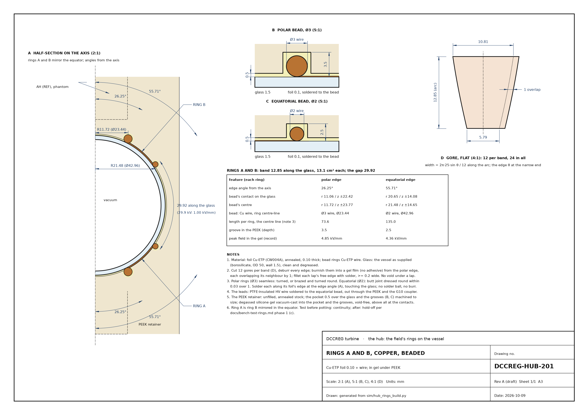
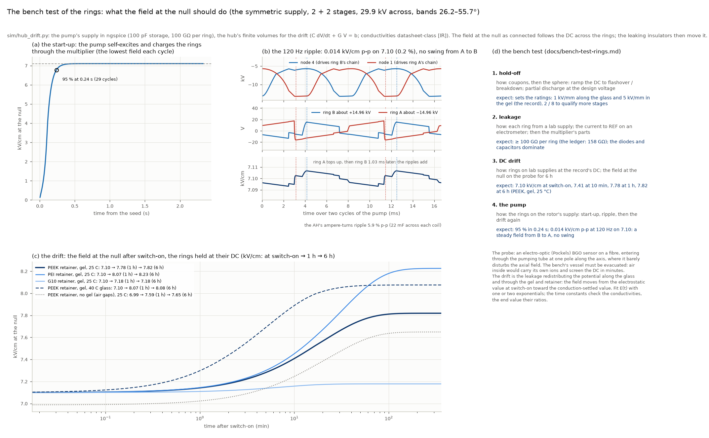

# DCCREG turbine — design ledger and fact sheet

**The design lock of 2026-10-09, revised the same day after the settlement of its inconsistencies and open points.** A
temporary documentation ledger and the current fact sheet of the exercise.

| | |
|:--|:--|
| status | **LOCKED for now** — the designer, 2026-10-09: "Let's lock the design for now." |
| design state | the lock's baseline is commit `09243c7` on branch `claude/new-session-0az7f9`. The settlement (2026-10-09; §2.3, §6) brought the records into line with it, corrected two computed values (the field at the null with the beads; the beads as drawn) and added first cuts, which stay PROPOSED until the designer accepts them |
| what the lock means | the design of record below is the baseline; later changes are recorded against it. The lock does not settle what is still PROPOSED or OPEN (§5): those keep their status |
| this ledger | `docs/ledger/DCCREG-design-ledger.md` (the source) and `.pdf` (its print form) |
| the drawings | `docs/ledger/DCCREG-drawings-bundle.pdf`: 50 sheets behind a two-page register (§7) |
| how it is built | `python3 docs/ledger/make_ledger.py` (needs markdown-it-py, mdit-py-plugins, pypdf and playwright with Chromium) |

**Abstract.** As locked, the DCCREG turbine is a belt-driven tube machine. Its rotor and counter-rotor turn at 600 rpm
in opposite directions through a 1 : −1 reversing gear.
- **Two pumps on each shaft half,** both run by the relative rotation at 120 Hz:
  - **the magnetic pump:** three wound utrons pass six iron bridges, wired as the planar dual of a diode charge
    doubler, and drive the anti-Helmholtz (AH) coil pair;
  - **the electrostatic pump:** an air vane stack in a de Queiroz diode doubler drives two copper rings on the
    outside of a 50 mm glass vacuum sphere, through two mirrored Cockcroft-Walton chains.
- **Two static fields at the sphere's centre:**
  - the AH's steady magnetic cusp (300 ampere-turns per coil), with its null at the centre;
  - a DC electric field of 7.62 kV/cm (2.57 Pa) at switch-on, settling to 8.2 kV/cm as the insulators leak. It points
    from ring B to ring A and is steady to 0.19 %.
- **Where the power goes:** the pumps take about 21.5 W from the belt, and the windage and the bearings about 17 W more,
  about 39 W in all. All of it ends as heat in the clamps, the copper, the iron, the air and the bearings. The products
  are the fields.
- **What is still open:** the physics is mainstream throughout [OC]. The ratings, the leakage and several parts are
  placeholders that the bench test must qualify.

**Reading notes.**
- **Tags** (`CONVENTIONS.md` §1):
  - [OC] standard, derivable physics;
  - [IR] a modelling or engineering choice, including datasheet-class values;
  - [RH] a heuristic or placeholder, not load-bearing until qualified.
- **Status words** (as the presets use them):
  - DECIDED: by the designer;
  - PROPOSED: worked out here and used, not yet accepted;
  - REGISTER: carried over from an earlier register;
  - DESIGN: the current sizing;
  - OPEN;
  - ESTIMATE.
- **"The record"** is the design of record.
- **Sources:** every number cites the file that holds it; the paths are from the repository root.

## 1. The machine at a glance

**The bodies.**
- **The rotor** carries:
  - the split shaft, which is the electrical reference (REF);
  - the hub;
  - the rotor vanes of the electrostatic stacks;
  - the wound utrons;
  - every circuit part of both pumps.
- **The counter-rotor** carries:
  - the stator cage;
  - the stator vanes, which are REF for the varicaps;
  - the passive iron bridges.
  It holds no wires, and it reaches the shaft through one inner bearing, the reference link.
- **The frame** holds the two end bearings, the reversing gear and the drive. The gear puts the same torque on both
  bodies, and its carrier, held by the frame, takes twice it (`docs/drive-gear-belt.md` §1).
- **The axis** is vertical: side A below, side B above, mirror images about the hub's equator.

**The two pumps** run at 1200 rpm relative, 120 Hz.
- **The magnetic pump:**
  - each side's three utrons form one group, A or B, whose inductance swings 9.4 ↔ 81 mH per coil as the bridges
    pass;
  - groups A and B run in antiphase, in a circuit that is the exact dual of a diode charge doubler;
  - the saturating NiFe neck in each utron is the clamp;
  - one AH coil sits in each group's branch, and a 22 mF bypass across it (PROPOSED) holds a steady 300 ampere-turns.
- **The electrostatic pump:**
  - the varicaps C1 / C2 swing 55 ↔ 410 pF in antiphase;
  - the de Queiroz diode doubler multiplies its charge each cycle until the clamps Z1 / Z4 hold the nodes at their
    13.1 kV operating peak;
  - the pump's nodes 1 and 4 then feed two mirrored Cockcroft-Walton chains standing on the shaft, which pump ring A
    to −15.0 kV and ring B to +15.0 kV.

**The hub** is a 50 mm borosilicate vacuum sphere with a 1.5 mm wall.
- The two MnZn AH cores sit on its axis.
- The two copper-foil rings lie on the glass, under 0.5 mm of silicone gel in a PEEK retainer, with a G10 coupler
  outside.
- At its centre the AH's null and the rings' field coincide.

**The design in numbers**

| quantity | value | source |
|:--|:--|:--|
| speed | 600 rpm each way, 1200 rpm relative; both pumps at 120 Hz | `sim/pole-design-findings.md` §6; `sim/core_field.py` |
| tube | 940 mm: the air stack of record and the locked hub in solids, 153 solids without a clash | `sim/tube-shaft-findings.md` §0 |
| diameters | vanes Ø300 mm; bridge ring Ø313 mm; stator cage Ø332 mm | `sim/pole-design-findings.md` §8 |
| magnetic pump, per side | 3 wound utrons (200 turns, 2.23 kg each) and 6 SiFe bridges, gap 0.5 mm | `sim/pole-design-findings.md` §8 |
| AH | 160-turn coils on Fair-Rite 77 MnZn rods (0.80 mm wire, 0.333 Ω as wound); 22 mF bypass each (PROPOSED); 290–308 A-turns (300 mean, ±3 %; 294 as wound) | `sim/ah-steady-cusp-findings.md`; `sim/hub-thermal-findings.md` §1 |
| the AH's null | at the centre; 0.113 T/m; within ±0.44 mm over a cycle with the bypass, ±6.4 mm without | `sim/ah-null-findings.md` |
| electrostatic pump, per side | 6 + 6 Al vanes 3 mm, full rounds R1.5, 6 mm air gaps; C1 / C2 55–410 pF; Ca / Cb 451 pF | `sim/air-stack-sizing-findings.md` §6.5 |
| operating peak | 13.1 kV at the clamps (the 6 mm gap's breakdown over 1.5) | `sim/air_stack_sizing_results.json` |
| rings | Cu foil 0.10 mm, 26.25–55.71° from the axis; beads Ø3 / Ø2 mm; 29.9 mm apart along the glass | `docs/rings-design.md` §2 |
| rings' supply | symmetric: −14.96 / +14.96 kV on 2 + 2 Cockcroft-Walton stages from the shaft | `sim/hub_rings_build_results.json` record |
| field at the null | 7.62 kV/cm from B to A at switch-on, 2.57 Pa (the bands alone 7.10); 8.20 kV/cm once settled at 25 °C; ripple 0.014 kV/cm p-p (0.19 %); no sign change in a revolution | `sim/hub-beads-settled-findings.md` §2; `sim/hub_drift_results.json`; `sim/hub_revolution_results.json` |
| power from the belt | magnetic 18.1 W + 1.25 W iron; electrostatic 2.14 W; windage about 12 W and bearings 5 W | `sim/ah-steady-cusp-findings.md`; `sim/core_field_results.json`; `sim/rotor-mechanics-findings.md` §5 |
| the hub's heat | the AH coils 1.22 W each: the coils at 43 °C, the glass at 32–37 °C in a 25 °C room | `sim/hub-thermal-findings.md` |
| cost (placeholders) | the stack of record's build 6,477 EUR; the cheapest qualifying build 6,060 EUR | `docs/cost/README.md` |

## 2. How the design got here

### 2.1 What the machine is for, as the record states it
- **The brief now,** in the designer's words (`sim/core-null-field-findings.md`): the centre of the vacuum core,
  where the AH null sits, should carry the strongest electrostatic field (pressure).
- **The AH pair** should hold a steady cusp (`sim/ah-steady-cusp-findings.md`).
- **Both pumps** are the supplies, driven from one belt through the 1 : −1 gear (`sim/hub-drive-findings.md`).
- **What the field at a magnetic null is to be used for is not documented.** This ledger records the brief as given
  and does not supply a purpose.

### 2.2 The path, in eleven steps

Each step asked a question, found an answer in mainstream physics and left a decision behind. The dates are the
commits' dates.

| # | step (dates) | the question | what was found | what it left |
|:--|:--|:--|:--|:--|
| 1 | the browser tool (to 06-09) | a sectored-disc varicap driving a symmetric Bennet doubler | blocks C-I, M, R, D, T, S in `index.html`; anchor z 1.203 | the tool, now retired and frozen |
| 2 | the disc spark-gap machine (06-11 → 06-29) | can a doubler with spark-gap commutation, a resonant tank and islands deliver energy | the doubler's equalisation *is* the pump; only a downstream sink recovers energy; η ≈ 0.70 is forbidden, η ≈ 0.45–0.50 (`docs/efficiency-resolution.md`) | the freeze v0.10 (C_R 789 pF); the efficiency principle |
| 3 | the drawn pump re-checked (09-29 → 10-02) | does the designer's drawn pump pump, exactly | exact engines and gates (PUMP-CALC, PUMP-SYNTH, GEOM stage 2, the integrity tool); z 1.325 on the drawing | the tools, frozen |
| 4 | the round trip and the design loop (10-03 → 10-05) | do the solids keep the gain | the field-solved floors and strays (about 1 nF) take z to 0.83–0.89 (NO-FLOOR-IN-RANGE); interleaved stacks recover 1.24; with the motor in, z = 1.000 | interleaved stacks of vanes are the way to C; the motor cannot sit across Ca |
| 5 | the register and the motor (10-05) | can the C-EMs turn the counter-rotor | they are about five orders short, and the pump's own reaction torque (78 mN·m) needs an outside drive | the belt and the reversing gear |
| 6 | the tube (10-05 → 10-07) | an elongated machine with vane stacks along the shaft | C1 1.11 nF, κ 15.7 in vacuum; diodes beat spark gaps (η 1.00, 3.0 W against 1.3 W at η 0.53) | the de Queiroz diode core is the electrostatic pump |
| 7 | the pivot: two geared pumps (10-07 → 10-08) | drive the AH from the belt too | the planar dual of the doubler works (z 1.528 against 1.512); wound utrons and passive bridges; the mean-turn fix moves the pick to 2.34 kg, 200 turns, 18.8 W | the magnetic pump of record |
| 8 | the air build (10-08) | the first tests run in air | air takes about a third of the vacuum field; 6 mm gaps, full-round vanes, the 6 + 6 cap: 2.14 W; the AH bypass for a steady cusp; the vane matrix and the cost sheet | the electrostatic stack of record |
| 9 | the field at the core (10-08) | the strongest field at the AH null | HV side onto the rotor (unchanged pump); cones steady or swinging (≈1.4 kV/cm); a DC pair inside the vacuum (65.7 kV/cm, but feedthroughs) | the hub locked; the field needs electrodes |
| 10 | the rings (10-09) | rings outside the glass | the beads, not the separation, set the stages; asymmetric 6.93 kV/cm → symmetric 7.10 kV/cm on the bands alone; steady, no swing | the rings and supply of record (`docs/rings-design.md`) |
| 11 | the settlement (10-09) | do the records agree, and what can be settled before the bench | the lock's 18 inconsistencies resolved and 12 more found and settled; with its beads the null reads 7.62 kV/cm; the beads settled, the hub's heat, the AH null, the rotating mechanics, the drive and the parts' first cuts, the model checks (§6) | the decisions of §5.2 |

### 2.3 The designer's decisions

| date | decision | where recorded |
|:--|:--|:--|
| 06-16 | the freeze v0.10 of the disc machine (12 mm septum, C_R 789 pF) | `docs/varcap-design-freeze-v0.10.md` |
| 10-03 → 10-05 | the design loop's rulings: the machine floats; septum ≤ 1000 mm; N = 2; garolite, not PTFE | `sim/rt-design-predictions.md` |
| 2026-10 (pivot) | rotor and counter-rotor geared 1 : −1; the AH on a magnetic pump; both pumps on the belt | `sim/hub-drive-findings.md` |
| 10-08 | "the first tests run in air"; vanes with full-round edges; the 6 + 6 cap | `sim/air-stack-sizing-findings.md` |
| 10-08 | "the AH pair should hold a steady cusp" | `sim/ah-steady-cusp-findings.md` |
| 10-08 | the reference link through an inner bearing "for now", a brush later | `sim/rotor-parts-duty-findings.md` §4 |
| 10-08 | the HV side on the rotor | `sim/core-field-findings.md` (decision 1) |
| 10-08 | the hub locked: layer order, the 50 mm borosilicate sphere, symmetric pumps | `presets/hub-locked.json` |
| 10-09 | the rings outside the glass; a 1.5 mm wall; the AH flanges outside the vessel | `presets/hub-locked.json`; `sim/hub-locked-findings.md` |
| 10-09 | copper foil with rounded edges for the prototype, a fired-on coating later | `sim/hub-rings-build-findings.md` (brief) |
| 10-09 | "go multistage as long as the rings' separation can hold it" | `sim/hub-rings-build-findings.md` (brief) |
| 10-09 | the symmetric supply: "if it pumps against the core centre, yes!" | `docs/rings-design.md` |
| 10-09 | **"Let's lock the design for now."** | this ledger |
| 10-09 (the settlement) | keep the stack of record (6 mm gaps, V_op = breakdown / 1.5, 22° / 22°, r 150, Ca = 1.1 C_max) and the clamps Z1 / Z4 | §5.1 |
| 10-09 (the settlement) | accept the magnetic pick and the retainer's materials (PEEK, the silicone gel, the G10 coupler outside); the 22 mF bypass and the equatorial split stay PROPOSED | `presets/hub-locked.json`; §5.1 |
| 10-09 (the settlement) | rewrite `README.md` and `CLAUDE.md` for the locked machine | `README.md`, `CLAUDE.md` |

### 2.4 What was learned, and what it superseded
- **Charge pumps pay their equalisation tax inside the core** [OC].
  - A doubler with lossy transfers cannot recover what it spends, and only a downstream sink recovers energy. The
    disc machine's claimed η ≈ 0.70 is forbidden (`docs/efficiency-resolution.md`).
  - With smoothly varying capacitance and diodes the transfer itself is lossless (η 1.00), and that is the pump kept
    (`sim/diode-stack-findings.md`).
  - Spark gaps, islands, shuttles and the resonant tank are superseded.
- **Strays and floors set the gain, not size** [OC].
  - The disc's field-solved floors and strays scaled with the build (`sim/round-trip-findings.md` §5).
  - Interleaved vane stacks along the shaft give the capacitance without the carriers' penalty, hence the tube.
  - In air the fixed 20 pF node stray is what pulls the capped stack's z from 1.38 to 1.31
    (`sim/air-stack-sizing-findings.md` §6.5).
- **A pump's reaction torque must go somewhere** [OC]. The C-EMs could not counter-rotate the stator, so the drive
  is an outside belt with a 1 : −1 gear, and every reaction torque goes into the frame (`sim/spinup-findings.md`).
- **The dual circuit works.** Inductors for capacitors, currents for voltages and flux for charge give a magnetic
  pump with its own gain. A saturating neck is its clamp, which makes it the natural driver for the AH coils
  (`sim/magnetic_doubler.py`, `sim/pole-design-findings.md`).
- **Air sets the voltage, the rims the vanes and the cap the power** (`sim/air-stack-sizing-findings.md`):
  - 6 mm gaps for a 13.1 kV peak;
  - 3 mm full-round vanes for the corona margin;
  - 6 + 6 vanes for 2.14 W.
- **The field at a null needs electrodes; outside the glass they need edges** (`sim/hub-rings-build-findings.md`).
  - The vacuum pair inside reached 65.7 kV/cm but needed two HV feedthroughs.
  - The rings need none. Their beads facing the AH coil ends, not their separation, set how many stages they hold.
- **Solve what is built** [IR]. The beads were sized in local boxes and never put back in the hub, so the record's
  null missed their 7 %; the drawing's grooves bring the PEEK to the beads, which the boxes had filled with gel
  (`sim/hub-beads-settled-findings.md`).
- **Only the difference between the rings makes field at the null** [OC].
  - The pump's nodes are twins, so identical circuits give none.
  - The record's mirror chains put the null at the shaft's potential and each ring 15 kV from it, and the field is DC
    (`sim/hub_revolution.py`).

## 3. The components and how they work

### 3.1 Bodies, drive, bearings and the reference

- **The rotor** turns at +600 rpm and carries all of both pumps' circuits, so no wire crosses between the bodies
  (`sim/core-field-findings.md` §1, §7). It is the split shaft (two halves, each ending in a flange at the hub) with:
  - the G10 sleeve;
  - the rotor vanes (nodes 1 / 4);
  - Ca / Cb, D1–D4 and Z1 / Z4;
  - the utrons on two 12 mm G10 carrier discs per side;
  - La / Lb and D1*–D4*;
  - the hub.
- **The counter-rotor** turns at −600 rpm and carries no HV (`sim/tube_geometry.py`; `sim/pole-design-findings.md`
  §8). It carries:
  - the G10 stator cage (r 162–166 mm), one tube across the hub;
  - the stator vanes (REF);
  - the four inner bearing spiders;
  - six M235-35A bridges per side in a G10 ring, with side B's offset 30°.
- **The frame** holds the two end bearings and their housings, the 1 : −1 reversing gear, the drive motor and the
  belt. **The drive's first cut** (PROPOSED, `docs/drive-gear-belt.md`):
  - a bevel reverser at side A, its carrier held by the frame: two stainless side gears (z 30, m 2) and three POM-C
    pinions;
  - an HTD 5M belt, 4 : 1, from a 200 W brushless motor whose driver ramps and limits the current;
  - the gear puts 0.48 / 0.52 N·m on the bodies and 1.00 N·m into the frame; the belt carries 59 W with a 25 W
    windage allowance; the run-up takes 32 s;
  - the pumps' 120 / 240 Hz pulsation stays in the bodies: the gear sees 0.061 N·m p-p;
  - 1,066 EUR against the cost sheet's 800.
- **The bearings:** six 6205-class deep-groove bearings (25 / 52 / 15 mm), each on an 8 mm G10 spider.
  - The four inner ones join rotor and counter-rotor at the relative speed; only the two end bearings face the frame.
  - **So the counter-rotor floats on the shaft** (`sim/tube-shaft-findings.md` §0; `sim/rotor-mechanics-findings.md`
    §4, an independent model that agrees). As laid out (d 25) the first mode is 27–29 Hz, and 1 g lateral moves the
    utron gap 123 µm at the stack's centre and 1.7× that at its outer end.
  - **The ways out:** d 40 gives 65 Hz and 25 µm. A bearing between the shaft and each bridge ring's outer end gives
    131–165 Hz (realistic to stiff seats) and 2–3 µm, but on G10 spiders it sits only 9 % above the pumps' 120 Hz, and
    the layout grows 10–20 mm a side for it. The choice is the designer's (§5.2).
  - **The gap budget:** each inner bearing's total runout within 0.027 mm as laid out (P5 bearings under an axial
    spring preload), or 0.05 mm with the eighth pair (`sim/rotor-mechanics-findings.md` §5).
- **The shaft:**
  - it is d 25 in the tube model and d 30 in the hub's register: OPEN, with the bearings (§5.2). A 6205 needs 25 mm
    journals;
  - non-magnetic, μ_r ≤ 1.05: annealed austenitic stainless. Steel halves would tie the AH null to how each seats, and
    titanium drops the first mode to 21 Hz (`sim/ah-null-findings.md` §5; `sim/rotor-mechanics-findings.md` §4);
  - it is split at the hub, each half bolted at its flange (r 32 × 8 mm at ±72–80 mm in the locked hub).
- **The rotating loads** (`sim/rotor-mechanics-findings.md`):
  - no banding is needed: at 750 rpm every part holds with a factor of 19 or more, if the studs are preloaded and the
    joints bonded in the impregnation;
  - balance each body to G2.5;
  - windage takes about 12 W and the bearings 5 W.
- **The reference link.** The counter-rotor's stator vanes are REF for C1 / C2. They reach the shaft through one inner
  bearing:
  - the path is rail → lead → outer ring → balls → inner ring → shaft;
  - it carries the varicaps' displacement current, 0.41 mA rms of pure AC with no DC (`sim/core_field_results.json`).
  - A floating counter-rotor would need about 10 nF to the shaft, and at 100 pF the pump stops, so the bearing link
    stays. It is not acceptable with a spark dump or without clamps, where the surges need a brush
    (`sim/rotor-parts-duty-findings.md` §4).

### 3.2 The magnetic pump: utrons, bridges and the dual doubler

**How a bridge makes an inductance that swings** [OC].
- A utron is a U-core electromagnet on the rotor. Its two radial tips face the counter-rotor at r 130 mm.
- When a passive SiFe bridge spans both tips, the flux closes across two 0.5 mm gaps and the coil's inductance is
  high: 81.0 mH. Between bridges the nearest iron is 9.74 mm away and it falls to 9.4 mH (κ 8.6).
- Six bridges on a 60° pitch at 1200 rpm relative swing it at 120 Hz. Each bridge sees the three utrons pass, so it
  carries unipolar flux at 60 Hz (`sim/pole-design-findings.md` §8).

**The dual doubler** (`sim/magnetic_doubler.py`).
- The electrostatic diode doubler's circuit graph has a planar dual: capacitors become inductors, voltages currents,
  charge flux.
- In it, the two varicaps become the two utron groups L1(θ) / L2(θ), three utrons in series each (0.243 H). Ca / Cb
  become the chokes La / Lb (0.146 H), and the diodes become D1*–D4*.
- The bridges of side B sit half a pitch on from side A's, so the groups are in antiphase.
- When a group's inductance falls while its flux is held, its current rises: it generates, and the belt does the work
  against the bridges' pull. When the inductance rises the group motors. The groups swap every half cycle.
- Per cycle the stored flux grows by a fixed factor: z 1.21 in the design screen's linear model, against a selection
  rule of ≥ 1.20. The loaded transient run reads 1.139 early on, and 1.147 with the AH bypass
  (`sim/pole_design_variants_op.json`; `sim/ah-steady-cusp-findings.md`).
- Its duality check against the electrostatic doubler gave z 1.528 against 1.512 (`sim/hub-drive-findings.md`).

**The clamp, the start and the parts.**
- **The clamp.** The dual of the avalanche clamps is the iron's saturation. A 3.0 mm 80 % NiFe strip under each
  utron's back iron saturates at Ψs 0.134 Wb-turns per group, and the current then stops growing. The law
  i = Ψ/L·(1 + (Ψ/Ψs)⁶) is a fit [IR]. The neck is sized to the AH's need and no larger, because heat goes as Ψs²
  (`sim/pole-design-findings.md` §3, §8).
- **The start.** With the deck's diodes (0.54 V at 1 A, a Schottky-class drop) a small seed does not grow, because the
  winding voltage while growing is only a few volts. A one-time kick starts it: the record's 20 % of Ψs seeds 0.110 A
  and 3.5 mJ (`sim/pole-design-findings.md` §7); the threshold is 16 %, 2.2 mJ (`sim/parts-first-cut-findings.md` §3).
  - **At full speed,** 600 rpm each way and never below 500: the pump starts at every rotor phase only from 1000 rpm
    relative, and a running pump stops below about 750. At 200 rpm each way the kick dies within 8 cycles.
  - **The first cut (PROPOSED):** a 9 V lithium cell charges a 470 µF bipolar capacitor, and an SCR dumps it across La
    (+ to node a) when a reed switch on the rotor passes an outside magnet: 19 mJ, 0.60 A, 17 ms, once per charge.
  - **The sign is the diodes':** a seed of the other sign starts the pump in the deck's own sign, so polarised bypass
    parts go + to nodes d / b.
- **The parts:**
  - the utrons: M235-35A 0.35 mm laminations, stack 100 mm, 200 turns of Ø1.55 mm Cu, 0.58 Ω, 2.23 kg each as built;
  - La / Lb: 0.146 H DC chokes, 0.87–1.15 A, ≤ 110 V. First cut (PROPOSED): EI-84 laminations, a 35 mm stack,
    150 turns of Ø1.40 mm, a 0.126 mm gap trimmed to 0.146 H; R20 0.276 Ω, 1.20 T at the peak, 1.66 kg each
    (`sim/parts-first-cut-findings.md` §1);
  - D1*–D4*: reverse 113 / 104 / 58 / 60 V with the start-up, 1.9 / 2.3 A peak in each diode (2.8 A in the branch).
    First cut (PROPOSED): Schottky, 200 V (D1* / D2*) and 150 V (D3* / D4*), ≥ 3 A. Silicon rectifiers (0.85 V)
    would cost z 1.139 → 1.074 and the AH 449 → 423 A-turns (§2.1 there);
  - snubbers: an RC at each of the eight nodes (21 nF + 243 Ω in the deck; first cut 22 nF film + 240 Ω) [IR];
  - the wiring stray Lp2 / Lp3: 4.4 mH [IR];
  - the coils run at 46 °C in air (63 °C in vacuum), at the model's 40 °C ambient (`sim/pole_design.py`).
- **The power:** 17.6 W on the belt without the bypass (utron copper 12.9, AH 2.00, La / Lb 0.66, diodes 2.01), plus
  1.25 W of iron. With the bypass the belt reads 18.1 W (`docs/schematic-rotor-circuits.png`;
  `sim/ah-steady-cusp-findings.md`).

### 3.3 The AH pair and the steady cusp
- **The pair:** two coils on the shaft's axis, one in each group's branch:
  - 160 turns each, 1.01 mH. As wound, 0.80 mm grade-1 wire in 4 orthocyclic layers fills the window: 0.333 Ω at
    20 °C, against the deck's 0.27 Ω, which scaled a window of bare copper (`sim/hub-thermal-findings.md` §1). It
    drives 294 A-turns instead of 300 with the bypass;
  - wound on G-10 formers around Fair-Rite 4077484611 rods of 77 MnZn ferrite, Ø12.3 mm, at ±30.7–72 mm;
  - seated in PEEK 5.7 mm from the vessel (`presets/hub-locked.json` AH, AH_seat).
- **Anti-Helmholtz:** they are wound to oppose, so their fields cancel at the centre (the null) and rise linearly
  away from it, the cusp [OC].
  - **Each branch carries its own side's coil.** Both coils' currents are unipolar and of the same sign in their
    elements' orientation (x1 → d, x2 → b).
  - **How to wind them:** two identical coils, each with its start lead to its group's utrons and its finish to the
    diode side, mounted as rotated copies with their start leads toward the vessel. A translated copy would make the
    pair Helmholtz (`sim/ah-steady-cusp-findings.md`, the winding sense).
- **The null's position** (`sim/ah-null-findings.md`):
  - balanced, it sits at the centre, with 0.113 T/m along the axis (0.377 mT/m per A-turn on both coils; 0.111 T/m as
    wound), −½ of that across. The rods raise it 4.8×;
  - each A-turn of imbalance moves it 25 µm toward the weaker coil. With the bypass it stays within ±0.44 mm over the
    120 Hz cycle; without it it swings ±6.4 mm, beyond the ±5 mm where the rings' field holds 4.4 %;
  - the earth's vertical field moves it 0.35–0.5 mm; a 0.5 mm misplaced coil, 0.25 mm.
- **The steady cusp.**
  - Without a bypass, each coil carries its branch's unipolar 139–449 A-turns at 120 Hz. Top and bottom peak in
    turn, so the null moves along the axis every cycle.
  - A 22 mF capacitor across each coil (34 Hz with the coil, far below 120 Hz) carries the ripple. Each coil then
    holds 290–308 A-turns (300 mean, ±3 %), and top and bottom stay within 17 A-turns (`sim/ah-steady-cusp-findings.md`).
  - 2.2 mF would resonate near 107 Hz and make the ripple worse. The capacitor's duty is light: 0.65 A rms, about
    0.5 V, 8 mW for the pair.
- **The cost of steadiness:** the steady field is the mean, 300 A-turns, against the 449 A-turn peak the AH was
  sized to. A steady 450 needs 240 turns or a larger pump, which is not re-sized.
- **The rods** peak at 0.121 T at 300 A-turns. They reach the register's 0.30 T limit [RH] at 743 A-turns for the AH
  alone; the record's "about 600" scaled a run with the cone windings in series (`sim/ah-null-findings.md` §4).

### 3.4 The electrostatic pump: the vane stack and the diode doubler

**The varicaps C1 / C2** (`sim/air-stack-sizing-findings.md` §6.5).
- On each side, 6 stator vanes (REF, counter-rotor) interleave with 6 rotor vanes (node 1 on side A, node 4 on side B)
  across 11 gaps of 6 mm in air.
- The vanes are aluminium, 3 mm thick, every exposed edge a full round R1.5. Each has six 22° sectors on a 60° pitch,
  r 50–150 mm.
- With the sectors aligned the stack is 410 pF. With the rotor's sectors centred between the stator's it is 55 pF
  (κ 7.47).
- C1 and C2 sit half a pitch apart, so they swing in antiphase six times a relative revolution: 120 Hz.

**The doubler** [OC] (`sim/core_field.py`; de Queiroz's symmetrical generator, its Fig. 1 with every diode reversed:
the same circuit at negative polarity).
- **The circuit:**
  - C1 from node 1 and C2 from node 4 to REF;
  - transfer capacitors Ca (1–2) and Cb (3–4) of 451 pF;
  - four diodes: D1 2→0, D2 3→0, D3 1→3, D4 4→2.
- **One half cycle, step by step:**
  1. The capacitor that is shrinking keeps its charge, because its diode is blocked, so its voltage rises as Q/C. The
     rotation does work against the vanes' attraction.
  2. Through Ca or Cb that lift pulls the next node until a diode conducts.
  3. The charge then pours onto the other varicap while it is large, so it accepts the charge at low voltage.
- **The gain.** Charge is collected while a capacitor is large and lifted while it is small, so it grows each cycle
  by a fixed factor: z 1.31 bare (1.3095 in ngspice). With the rings' chains attached, z is 1.191 at start-up.
- **Self-excitation.** Between diode events the circuit is linear and scale-free, so any seed in the growing mode (a
  contact potential, a triboelectric charge) multiplies by z every cycle [OC].

**The clamps and the operating point.**
- z > 1 at every amplitude, so something must stop the growth. The clamps Z1 (node 1) and Z4 (node 4) are avalanche
  strings, first cut 66 × 200 V (1.5KE200A-class parts, one lot, sorted and trimmed warm:
  `sim/parts-first-cut-findings.md` §2.4). They break down at the operating peak V_op 13.13 kV, conduct once a cycle near the
  peak and turn the whole surplus into heat: 1.07 W each, 0.95 mA peak (`sim/core_field_results.json`).
- **V_op** is the 6 mm air gap's breakdown, 19.7 kV, over a 1.5 margin [RH].
- **The rims' field** at 13.1 kV is 44.4 kV/cm, 0.80 of Peek's onset (55.7 kV/cm). Corona starts at 16.5 kV on a
  smooth surface and 14.0 kV on a handled one, margins of ×1.26 and ×1.07 (`sim/air_stack_sizing_results.json`).
- **The nodes:**
  - nodes 1 and 4 swing −13.2 ↔ −5.7 kV, half a cycle apart (mean −8.6 kV);
  - nodes 2 and 3 swing 0 ↔ −6.1 kV.
  - D1–D4 see reverse peaks of 6.1 / 6.1 / 13.2 / 13.2 kV. First cut (PROPOSED): one 20 kV avalanche stick for D1 /
    D2 and two in series for D3 / D4, each with a 22 kΩ surge resistor (`sim/parts-first-cut-findings.md` §2.2).
- **The power:** the belt pays 2.14 W, all of it into the clamps.
- **Without clamps** the pump runs as a relaxation oscillator: it arcs at the stack, sends 25–47 A surges through the
  diodes and 38 A through the bearing link, so the clamps stay (`sim/electrostatic-no-clamp-findings.md`).
- **Ca / Cb:** 1.1 C_max, six full-annulus aluminium plates per side with 5 gaps of 6 mm, on the rotor. Adjacent
  plates differ by 5.7–7.5 kV, which needs 40 mm of creepage on PTFE or 80 mm on G10 (design; 32 / 64 mm by the
  standard) and 13 mm of clearance. So no mount may bridge two adjacent plates: a first cut rides the node-1 plates on
  the vane stack and hangs the node-2 plates on PTFE-sleeved tie-rods (`sim/parts-first-cut-findings.md` §4). Not
  drawn.
- **A vane flashover** at node 4, at its lowest point, lifts ring B from 14.96 to 19.0 kV until the leakage drains it:
  2 % past the bench's 1.25× hold-off. Before the DC settles, the polar bead's gel would then run at about 6.3 kV/mm
  (`sim/parts-first-cut-findings.md` §2.7) [IR]. OPEN for the designer (§5.2).
- **Strays:** 20 pF per node [RH]. Each pF costs about 0.003 of z (`sim/core-field-findings.md` §4).

### 3.5 The hub

Source: `presets/hub-locked.json` (locked 2026-10-08; the decisions of 2026-10-09).

| layer, inside out | what | status |
|:--|:--|:--|
| the vessel | borosilicate sphere, OD 50.0 mm, wall 1.5 mm (R_in 23.5 mm), ε 4.6, vacuum inside; about 0.8 MPa shell stress | DECIDED |
| the rings | two copper-foil bands on the outer surface (§3.6) | DECIDED / DESIGN |
| the AH | the MnZn rods with their 160-turn coils on the axis, PEEK seats at ±25–30.7 mm (§3.3) | DECIDED (placement) / REGISTER (dimensions) / DESIGN (the winding) / PROPOSED (the ends rounded to 1.5 mm) |
| the retainer | unfilled PEEK, ε 3.2, r ≤ 30 mm, ±72 mm; a 0.5 mm pocket over the glass with grooves for the beads | DECIDED (role; material, 10-09) / PROPOSED (the grooves' full-round tops; the dimensions' first cut) |
| the interface filler | two-part silicone gel, degassed and vacuum-cast into the pocket, ε 2.9, 0.5 mm | DECIDED (10-09) |
| the shaft coupler | G10 outside the PEEK, r 30–33 mm, ε 4.7 | DECIDED (role; G10, 10-09) / PROPOSED (a straight tube over the retainer and both flanges) |
| the shaft | split, flanges r 32 × 8 mm at ±72–80 mm; non-magnetic | DECIDED (layout) / REGISTER (d 30) / OPEN (with the bearings) |
| the pumps | each shaft half carries its side's electrostatic stack and utron group, symmetric top and bottom | DECIDED |

- **Why PEEK and gel:**
  - the glass–retainer interface is what holds the DC between the rings, and a dry machined fit leaves air gaps; the
    gel fills them, beds the beads and takes up the PEEK–glass expansion mismatch;
  - PEEK is non-magnetic and non-conducting, machines well and barely moves the field (−1.5 % to +0.7 % from alumina
    to PTFE);
  - it is the ten-times-less-conductive PEEK, against the glass and gel, that sets the drift (§3.7)
    (`sim/hub-rings-build-findings.md` §1).
- **Once the DC has settled** (minutes to hours; `sim/hub-beads-settled-findings.md`), conduction shares it by the
  conductivities [OC]:
  - the beads relax (0.69 / 1.88 kV/mm in the gel), and the PEEK, ten times less conductive than the gel, takes the
    DC: 2.3 kV/mm across the AH seat on average;
  - the drawn grooves' square top corners then hold 7 kV/mm in the PEEK and the AH end's square corner 7.9. Proposed:
    the grooves' tops full-round with 1.0 mm of gel (4.1 kV/mm) and the AH ends rounded to 1.5 mm at REF
    (4.5 kV/mm), about a fifth of PEEK's short-term strength. The AH seat stays 5.7 mm;
  - **the equatorial beads set a condition:** their gel holds 5 kV/mm only while the glass conducts at most 4.1 times
    the gel (4.4 with the full-round grooves). With the glass at 40 °C (5.4×) they reach 6.15 kV/mm;
  - the bead–glass contact wedge stays finite, and with the gel in place the voltage across it is at most half of
    air's Paschen breakdown. A void in the gel's place is not safe once settled: a sealed void reaching 0.5 mm from an
    equatorial contact is at 0.99 of it in service, 1.46 at 1 mm (`sim/hub-joints-findings.md` §4). The gel fills
    those wedges void-free.
- **The hub's temperature** (`sim/hub-thermal-findings.md`): the AH coils dissipate 1.22 W each. In a 25 °C room, with
  the air between the vane stacks 5 K above it [RH], the coils run at 43 °C and the glass at 32–37 °C, 32.5 °C
  between the rings.
- **The vessel's resistivity,** 1e13 Ω·m at 25 °C [IR], falls with 0.90 eV (the record's two points). Between the
  rings in service it is 4.2e12 Ω·m, 2.4 times the gel's conductivity: the beads hold, up to a room of about 30 °C if
  the gel's conductivity does not rise with temperature. The bench measures both (phase 3).
- **The coupler and the leads** (first cut, PROPOSED; `docs/rings-design.md` §2):
  - a straight G10 tube, Ø60 / Ø66 mm over |z| ≤ 80 mm, holding the PEEK retainer and both shaft flanges (turned to
    Ø60), each bonded and pinned;
  - each ring's lead leaves its equatorial bead along the bead's normal, through the PEEK and the coupler, and runs over
    the coupler to its own end;
  - the air outside sees at most 0.55 kV/mm.

### 3.6 The rings and their symmetric supply

**The rings** (`docs/rings-design.md`; drawing DCCREG-HUB-201, Figure 6).
- **The bands.** Two bands of annealed Cu-ETP foil, 0.10 mm, lie on the vessel's outer surface from 26.25° to
  55.71° from the axis. Ring B is the upper one, ring A its mirror.
  - Each band is 12.85 mm along the glass and 13.1 cm², and the equatorial gap is 29.9 mm along the glass.
  - Each band is cut as 12 gores, 5.79 → 10.81 mm wide, overlapped 1 mm and soldered, and burnished on. There is no
    adhesive film: the gel bonds it.
  - **The laps** (first cut, PROPOSED; `sim/hub-joints-findings.md` §2): each upper gore's free edge is a 0.1 mm step.
    As cut it lifts the gel's 1.20 kV/mm at switch-on to 3.5–4.4 kV/mm; under a solder fillet 0.2 mm wide, to 1.9.
    So the edges are deburred, each lap's free edge filleted and each lap burnished into the gel film, with no void
    under it.
- **The edges are beaded.** A bare foil edge concentrates the field, so each edge carries a soldered copper wire ring:
  - Ø3 mm at the polar edge, 73.6 mm along its centre line;
  - Ø2 mm at the equatorial edge, 135.0 mm;
  - **the closing joints** (first cut, PROPOSED; §3 there): a joint left proud raises the bead's field by about
    1 + 3.7 δ / w. The equatorial rings take one dressed to the round within 0.03 mm over 1 mm. The polar rings, 0.3–0.4 %
    under their rating, take none: they are best seamless (turned), or the AH ends rounded to 1.5 mm, which gives them
    2.3–2.4 %;
  - each bedded in a groove of the PEEK, 3.5 / 2.5 mm deep (proposed: full-round tops with 1.0 mm of gel, 4 / 3 mm
    deep).
- **Why these angles.**
  - The polar bead faces the AH coil's end across 5.4 mm of PEEK. A bigger bead comes closer to it, so the polar
    edge does not ease with size, and a ring at 15 kV needs its polar edge at 26° or more.
  - The gap across the equator holds the DC at 1 kV/mm along the glass.
  - Both beads hold 5 kV/mm in the gel [RH]: 4.98 / 4.46 kV/mm as drawn (4.85 / 4.36 in the build's box, which had
    gel throughout). The polar bead sits 0.4 % under its rating.
  - The rings' separation is not the limit; the beads are (`sim/hub-rings-build-findings.md` §2, §4).
- **Later:** a fired-on coating needs the same beads, or a resistive grading toward the pole.

**The supply: two mirrored Cockcroft-Walton chains** [OC] (Figure 7; `sim/core_field.py` dc,
`n_cw = n_cw_a = 2`, `a_ref = "shaft"`).
- **Ring B's chain:**
  - node 4 → Co1 → m1 → Co2 → m2;
  - clamp diodes Dc1 (shaft → m1) and Dc2 (b1 → m2), peak diodes Dp1 (m1 → b1) and Dp2 (m2 → ring B);
  - smoothing capacitors Cs1 (shaft–b1) and Cs2 (b1–ring B).
  - Each stage lifts the smoothing column by node 4's swing, 7.5 kV.
- **Ring A's chain** is the same ladder on node 1 with every diode reversed (Coa, Dca, Dpa, Csa). It lowers its
  column by 7.5 kV a stage.
- **How it pumps against the core centre.**
  - Both chains stand on the shaft (0 V). The hub is mirror-symmetric and ring A is ring B's negative, so the null —
    and the whole equatorial plane — sits at the shaft's potential with nothing connected to it [OC].
  - Each ring stands 15 kV from it, as far as its polar bead allows.
- **The parts and levels:**
  - 8 HV diode stacks, all at 7.5 kV reverse;
  - 8 capacitors of 100 pF / 30 kV, each holding a stage's 7.5 kV DC, except Co1 at 13.2 kV and Coa1 at 5.7 kV
    (nodes 4 and 1 sit at −8.6 kV mean);
  - the levels: b1 +7.49 kV, ring B +14.96 kV, a1 −7.49 kV, ring A −14.96 kV; about 27 mJ stored;
  - no Dk and no C_A (`sim/hub_rings_build_results.json` record_supply).
- **Why 100 pF:** it keeps the pump's start-up gain at 1.191 (1.03 at 1 nF), and still smooths the ripple to tens of
  volts.
- **The strays:** 5.1 pF from each ring to REF and 1.1 pF between the rings, behind diodes.

### 3.7 The field at the null, in space and in time

**How the field is computed** [IR] (`sim/core_rings.py`, `sim/hub_locked.py`, `sim/hub_rings_build.py`).
- An axisymmetric finite-volume solve of div(ε grad V) = 0 on the half hub, with 0.25 mm cells.
- REF is the AH envelope, the flanges, the shaft and the box.
- Each geometry is solved in two modes:
  - anti: the rings at ±1, which gives the field at the null per volt across;
  - sym: both at +1, which gives the strays.
- Any supply is their superposition, exact for this linear problem [OC]: E_null = k (V_B − V_A), with
  k = 0.2546 (kV/cm)/kV as built (0.2373 for the bands alone).
- The beads come from local solves with 0.025 mm cells, bounded by the hub's solution, and as drawn they also sit in
  the hub's maps (`sim/hub_beads_settled.py`).

**In space:**
- **At the null:** 7.62 kV/cm along −z (from B to A) and a pressure ε0E²/2 of 2.57 Pa, at switch-on. The beads add
  7 % to the bands' 7.10: they are at the ring's potential and reach past its edges toward the gap.
- **Within ±5 mm** it varies 4.4 % along the axis and 2.0 % across the equator.
- **Further out:** across the equator it rises to 8.5 kV/cm at r 16 mm. Along the axis it falls to zero at
  |z| ≈ 18 mm and then turns toward the AH cores, because each band sits between the null and an AH core, both at
  0 V.
- **In the insulation,** at switch-on:
  - 1.00 kV/mm along the glass between the rings, on average;
  - 4.98 / 4.46 kV/mm in the gel at the beads, as drawn;
  - 1.46 / 3.01 kV/mm in the glass under them;
  - each ring averages 1.81 kV/mm to the AH cores.
- **The retainer's ε** moves the field at the null by less than 2 %; the AH cores take about 13 % of it.

**In time** (the bench test's predictions are Figure 10, §5.3):
- **Start-up** from the pump's seed: 50 % at 0.12 s, 95 % at 0.24 s, 99 % at 0.33 s.
- **The ripple:**
  - ring A carries 34 V p-p and ring B 29 V p-p at 120 Hz;
  - ring A tops up as node 1 bottoms; ring B tops up 1.03 ms later, as node 4 peaks;
  - so the two mostly add: 57 V p-p across the gap, 0.014 kV/cm p-p (0.19 %) at the null.
- **No swing.** Over a whole revolution (12 pump cycles in 0.1 s) the field never changes sign.
  - Each chain's diodes pass charge one way only, and the storage capacitors hold the rings between cycles.
  - The hub turns with the rotor and the rings are symmetric about the shaft, so the rotation changes nothing at the
    null either.
  - A field swinging from A to B would need AC on the rings, through coupling capacitors. That gives about
    ±1.8 kV/cm, with the pressure peaking near 0.14 Pa [IR estimate, not simulated with the rings].
- **The drift.** With the rings held at their DC, the insulators' leakage moves the potential from the electrostatic
  toward the conduction-settled state [OC]. The conductivities are datasheet-class [IR].
  - PEEK with gel at 25 °C: 7.62 → 7.95 (10 min) → 8.18 (1 h) → 8.20 kV/cm (6 h), +7.6 %, half-way at 7.6 min.
  - PEI gives +10.5 %, G10 +2.0 % (its σ/ε matches the glass's), and the glass at 40 °C +8.5 % in about a third of
    the time.
  - Settled, the beads relax and the PEEK takes the DC (§3.5).
- **The leakage:** the ledger of paths gives 158 GΩ per ring, against a 100 GΩ estimate. The chains' diodes and
  capacitors dominate; the rings' own insulation is about 200 TΩ (`sim/hub-rings-build-findings.md` §3).

### 3.8 The cost

Source: `docs/cost/README.md`. Every price is a placeholder for a one-off prototype, in EUR [RH].

**The sheet** (`docs/cost/dccreg-air-build-cost-sheet.xlsx`) costs all 2700 vane-matrix stacks with live formulas.

**The placeholder targets:**
- 6.5 kV/cm at the null, which needs 27.4 kV across the rings on the symmetric supply (on the bands' 0.2373: the
  rings as built give 7 % more, so the picks are conservative);
- at least 2 W, with z ≥ 1.3;
- at most 6 + 6 vanes;
- corona-safe rims;
- 300 steady A-turns.

81 designs meet them.

| build | design | power | total |
|:--|:--|--:|--:|
| cheapest that qualifies | 6 mm gaps, 2.5 mm vanes, r 175 mm, 22°, 4 + 4 | 2.01 W | 6,060 |
| the stack of record (the designer kept it, 10-09) | 6 mm gaps, 3 mm vanes, r 150 mm, 22°, 6 + 6 | 2.14 W | 6,477 |
| lowest cost per watt | 8 mm gaps, 4 mm vanes, r 300 mm, 26°, 6 + 6 | 16.4 W | 8,368 (510 per W) |

**The fixed parts** are 3,754 before the 15 % contingency, about 70 % of the cheapest build (the BOM corrected at the
settlement: one 22 mF part per coil, six spiders, the utron's SiFe as built):
- magnetic pump 1,552;
- mechanics 1,282, including the gear 250, the drive 250 and the frame 300;
- hub 626;
- electrostatic 180;
- AH 114.

**The drive's first cut** costs 1,066 against the sheet's 800 for the gear, the drive and the frame
(`docs/drive-gear-belt.md`). The sheet keeps its placeholders until the designer accepts it.

**The stacks' cost** is per-part work, not metal (metal is about 8 %). Aluminium is the choice.

**The symmetric supply** costs 50 more than the asymmetric one: three more diodes and three more capacitors.

**Not costed:** re-sizing the AH or the pumps, the shaft for larger radii, design, test equipment, the vacuum system
and tooling.

## 4. Fact sheet: the numbers of record, with their sources

**Operating point and machine**

| item | value | source |
|:--|:--|:--|
| speed | 600 rpm each way, 1200 rpm relative | `sim/pole-design-findings.md` §6 |
| pump frequency | 120 Hz (6 sectors and 6 bridges per relative revolution) | `sim/core_field.py`; `sim/pole_design_variants_op.json` |
| tube length | 940 mm, the record in solids (153 solids, no clash) | `sim/tube-shaft-findings.md` §0; `sim/tube_geometry_record_results.json` |
| masses | rotor 33.4 kg, counter-rotor 33.1 kg from the solids; the other studies' own counts give 32.9–35.3 and 33.4–34.9 kg | `sim/shaft_bearings_record_results.json`; `sim/rotor-mechanics-findings.md` §6; `docs/drive-gear-belt.md` §3 |
| bearings | 6 × 6205-class (25 / 52 / 15 mm) on 8 mm G10 spiders; 4 inner, 2 end; the counter-rotor floats on the 4 inner | `sim/stack_sizing.py`; `sim/tube-shaft-findings.md` §0 |
| the shaft's modes | as laid out, d 25: f1 27–29 Hz, 123 µm gap change under 1 g lateral; d 40: 65 Hz, 25 µm; the eighth bearing pair: 131–165 Hz, 2–3 µm | `sim/tube-shaft-findings.md` §0; `sim/rotor-mechanics-findings.md` §4 |
| shaft | d 25 (tube model) or d 30 (hub register), OPEN; non-magnetic, μ_r ≤ 1.05 | `sim/stack_sizing.py`; `presets/hub-locked.json`; `sim/ah-null-findings.md` §5 |
| the gap budget | total runout per inner bearing ≤ 0.027 mm as laid out (P5, axial spring preload), 0.05 mm with the eighth pair | `sim/rotor-mechanics-findings.md` §5 |
| rotating loads | no banding (factors ≥ 19 at 750 rpm); balance G2.5 per body; windage about 12 W, bearings 5 W | `sim/rotor-mechanics-findings.md` |
| reference link | one inner bearing; 0.41 mA rms AC, no DC | `sim/core_field_results.json` |
| the drive (PROPOSED) | bevel reverser at side A, POM-C pinions; HTD 5M 4 : 1, 200 W motor; 0.48 / 0.52 N·m on the bodies, 1.00 into the frame; run-up 32 s | `docs/drive-gear-belt.md` |

**Magnetic pump** (per side unless stated; `sim/pole-design-findings.md` §7–§8, `sim/pole_design_variants_op.json`)

| item | value |
|:--|:--|
| utrons | 3 at 0 / 120 / 240° on two 12 mm G10 carrier discs; r 57–130 mm; tips 14 mm; slot 30 × 30 mm; stack 100 mm of M235-35A 0.35 mm |
| coil | 200 turns of 1.89 mm² (Ø1.55 mm), 50 % fill, mean turn 319 mm; R 0.58 Ω; L 81.0 / 9.4 mH (κ 8.6); τ 0.140 s |
| neck (clamp) | 80 % NiFe, 3.0 × 100 mm; Ψs 0.134 Wb-turns per group |
| bridges | 6 M235-35A sectors, r 130.5–144.5 mm, 25.5° face, 0.65 kg each, in a G10 ring r 131.5–156.5 mm; side B offset 30° |
| gap | 0.500 mm aligned, 9.74 mm unaligned; 0 clashes in 457 pairs |
| group | 3 utrons in series: 0.243 H; 0.87–2.81 A per branch; 101 V peak |
| La / Lb | 0.146 H DC chokes, 0.29 Ω in the deck, 0.87–1.15 A, ≤ 110 V; first cut EI-84 × 35 mm, 150 t of Ø1.40 mm, 0.276 Ω, 1.66 kg (PROPOSED) |
| D1*–D4* | 0.54 V at 1 A in the deck (a Schottky-class drop); 1.9 / 2.3 A peak; reverse 113 / 104 / 58 / 60 V with the start-up; first cut Schottky 200 / 150 V, ≥ 3 A (PROPOSED) |
| gain | z 1.21 (z_lin, the screen's linear model); 1.139 loaded early (z_early), 1.147 with the bypass |
| kick | once, at full speed (600 rpm each way, never below 500): the record's 20 % of Ψs seeds 0.110 A, 3.5 mJ; the threshold is 16 %; first cut K4, 470 µF + SCR, reed-fired (PROPOSED) |
| mass | 2.23 kg per utron as built (SiFe 0.89, NiFe 0.15, Cu 1.07, G10 0.12) |
| power | belt 17.6 W (18.1 W with the bypass) + iron 1.25 W; coils 46 °C in air at a 40 °C ambient |

**AH pair** (`presets/hub-locked.json`; `sim/ah-steady-cusp-findings.md`)

| item | value |
|:--|:--|
| cores | Fair-Rite 4077484611, 77 MnZn, Ø12.3 × 41.3 mm at ±30.7–72 mm; G-10 formers ID 13.5 / OD 16.5 mm |
| coils | 160 turns of 0.80 mm grade-1 wire in 4 layers, r 8.25–11.45 mm, ±31.35–71.35 mm; 1.01 mH; 0.333 Ω as wound (0.27 Ω in the deck); 1.22 W each, 43 °C |
| winding | two identical coils, start to the group's utrons, finish to the diode side; rotated copies, start leads toward the vessel |
| bypass (PROPOSED) | 22 mF per coil, ESR 10 mΩ [RH]; LC 34 Hz; 0.65 A rms, about 0.5 V, 8 mW for the pair |
| field | 290–308 A-turns per coil (300 mean, ±3 %; 294 as wound); top and bottom within 17 A-turns |
| the null | at the centre; 0.113 T/m (0.111 as wound); 25 µm per A-turn of imbalance; ±0.44 mm over a cycle with the bypass, ±6.4 mm without (`sim/ah-null-findings.md`) |
| rods | 0.121 T at 300 A-turns; 0.30 T [RH] at 743 A-turns for the AH alone |
| 77 MnZn | µi 2000; 0.51 T at 400 A/m (25 °C); Br 0.18 T; Hc 20 A/m; 1 Ω·m; Curie above 200 °C (Fair-Rite's data sheet, as a search rendered it; to verify, `presets/hub-locked.json` AH core) |

**Electrostatic pump** (per side unless stated; `sim/air-stack-sizing-findings.md` §6.5, `sim/air_stack_sizing_results.json`,
`sim/core_field_results.json`)

| item | value |
|:--|:--|
| vanes | 6 stator (REF) + 6 rotor (node 1 / 4), Al 3 mm, full rounds R1.5; 11 gaps of 6 mm air |
| sectors | 6 on a 60° pitch, 22° stator / 22° rotor; r 50–150 mm; 8° clearance each side at minimum C |
| rings of the vanes | stator ring r 150–162 mm into the G10 cage (r 162–166); rotor ring r 20.5–50 mm on the G10 sleeve (r 12.5–20.5) |
| C1 = C2 | 54.9–409.9 pF, κ 7.47 (4.81–37.3 pF per gap) |
| Ca = Cb | 450.9 pF = 1.1 C_max: 6 full-annulus plates, 5 gaps of 6 mm, on the rotor |
| stack length | 102 mm of C1 + 6 mm + 48 mm of Ca = 156 mm |
| operating peak | 13.13 kV (19.7 kV breakdown / 1.5 [RH]); face field 21.9 kV/cm; rim 44.4 kV/cm (0.80 of onset) |
| gain | z 1.31 bare (1.3095 ngspice); 1.191 at start-up with the rings' chains |
| nodes | 1 / 4: −13.2 ↔ −5.7 kV (mean −8.6); 2 / 3: 0 ↔ −6.1 kV |
| clamps | Z1 / Z4 avalanche strings, BV 13.1 kV (66 × 200 V, 1.5KE200A class, PROPOSED); 1.07 W, 0.95 mA peak each |
| D1–D4 | reverse peaks 6.1 / 6.1 / 13.2 / 13.2 kV; first cut 20 kV sticks (one / two in series) + 22 kΩ (PROPOSED) |
| power | belt 2.14 W, all into the clamps |
| aluminium (both sides) | rotor vanes 2.9 kg + Ca / Cb plates 6.1 kg; stator vanes 3.4 kg |

**Rings, supply and field** (`docs/rings-design.md`; `sim/hub_rings_build_results.json`; `sim/hub_drift_results.json`;
`sim/hub_revolution_results.json`)

| item | value |
|:--|:--|
| bands | 26.25–55.71°; 12.85 mm along the glass, 13.1 cm² each; gap 29.92 mm; Cu-ETP 0.10 mm, 12 gores per band, the laps' free edges filleted (PROPOSED) |
| beads | Ø3 mm polar (contact r 11.06, z ±22.42 mm), Ø2 mm equatorial (contact r 20.65, z ±14.08 mm) |
| ratings used | 1 kV/mm along the glass; 5 kV/mm in the gel at a bead [RH]; 2 / 8 to qualify |
| supply | 2 + 2 CW stages from the shaft; ring A −14.96 kV, ring B +14.96 kV; 8 diodes at 7.5 kV; 8 × 100 pF / 30 kV |
| k | 0.2546 (kV/cm)/kV as built; 0.2373 for the bands alone |
| at the null | 7.62 kV/cm, 2.57 Pa at switch-on (the bands alone 7.10); 8.20 kV/cm, 2.98 Pa settled at 25 °C; ±5 mm uniformity 4.4 % (axis) / 2.0 % (equator) |
| fields in the insulation | glass along the gap 1.00 kV/mm on average; gel at the beads 4.98 / 4.46 kV/mm as drawn; glass at the beads 1.46 / 3.01 kV/mm; to the AH 1.81 kV/mm |
| settled | gel at the beads 0.69 / 1.88 kV/mm; the PEEK 2.3 kV/mm across the seat; the equatorial beads hold while σ_glass ≤ 4.1 σ_gel |
| strays | 5.1 pF to REF each, 1.1 pF between |
| time | 95 % in 0.24 s; ripple 0.014 kV/cm p-p; one revolution 7.611–7.625 kV/cm; drift to 8.20 kV/cm in 6 h (PEEK, gel, 25 °C) |
| the hub's heat | coils 43 °C, glass 32–37 °C (32.5 °C between the rings) in a 25 °C room; the vessel 4.2e12 Ω·m there |
| leakage | 100 GΩ per ring used (ledger 158 GΩ); 4.5 mW |

**What more stages would give** (if the bench qualifies higher ratings; `sim/hub_rings_build_results.json` best_by_family)

| ratings (interface / gel) | stages a side | across | at the null (the bands alone) |
|:--|:--|--:|--:|
| **1 / 5 kV/mm (the record)** | **2** | **29.9 kV** | **7.10 kV/cm (7.62 as built)** |
| 1 / 8 | 3 | 44.3 kV | 7.80 kV/cm |
| 2 / 5 | 2 (wider bands) | 29.9 kV | 8.35 kV/cm |
| 2 / 8 | 4 | 57.9 kV | 13.38 kV/cm |

## 5. Status: decided, proposed, open

### 5.1 The record's parts by status

| part | status | note |
|:--|:--|:--|
| the 1 : −1 gear, the belt, two pumps per side | DECIDED | the gear and belt: a first cut, PROPOSED (`docs/drive-gear-belt.md`) |
| air for the first tests; full-round vanes; the 6 + 6 cap | DECIDED | |
| 6 mm gaps, V_op = breakdown / 1.5; 22° / 22°; r 150; Ca = 1.1 C_max | DECIDED (10-09) | the designer kept the stack of record; the cost optimum differs (§3.8) |
| the clamps Z1 / Z4 | DECIDED (10-09) | |
| the HV side on the rotor; the link through one inner bearing | DECIDED | "for now"; a brush later |
| the magnetic pick (g 0.5, 6 bridges, 1200 rpm, 200 turns) | DECIDED (10-09) | the basis of DCCREG-UTR-101 (Rev A draft) |
| the steady cusp (22 mF bypass) | PROPOSED | drawn dashed on the schematic; it holds the null within ±0.44 mm |
| La / Lb, D1*–D4*, D1–D4, the clamp strings, the chains' parts, the kick source, creepage and potting | PROPOSED (first cuts) | `sim/parts-first-cut-findings.md` |
| the hub: layer order, sphere, wall, AH placement, symmetric pumps | DECIDED | |
| the rings outside the glass, copper foil, the symmetric supply | DECIDED | |
| the bands and beads | DESIGN | from the [RH] ratings; as drawn the polar bead sits 0.4 % under its rating |
| the PEEK retainer, the gel, the G10 coupler | DECIDED (materials, 10-09) | |
| the grooves' full-round tops, the AH ends rounded, the coupler as a tube, the leads' path | PROPOSED | `docs/rings-design.md` §2 |
| the joints' finish: filleted laps, seamless polar rings, dressed equatorial joints, void-free contacts | PROPOSED | `sim/hub-joints-findings.md` §5 |
| the retainer split at the equatorial plane | PROPOSED | |
| the shaft's diameter and the bearings | OPEN | the designer's choice (§5.2) |
| the ratings, the leakage, the conductivities | OPEN / ESTIMATE | the bench qualifies them |

### 5.2 Open items

**For the designer to decide** (each has its numbers in this ledger):
- **the shaft and its bearings** (§3.1): six bearings with d 40 (65 Hz, the runout at 0.027 mm), or an eighth pair
  between the shaft and each bridge ring's outer end at d 25 (131–165 Hz, the runout at 0.05 mm; the layout +10–20 mm
  a side; stiff seats to keep it clear of 120 Hz);
- **the drive's first cut** (§3.1, `docs/drive-gear-belt.md`): accept it, or set the gear and belt otherwise;
- **the bypass and the split**, both PROPOSED;
- **the hub's first cuts** (§3.5): the grooves' full-round tops, the AH ends rounded to 1.5 mm (which also gives the
  polar beads 2.3–2.4 % of margin), the coupler as a tube with the flanges turned to Ø60, the leads' path;
- **the rings' joints** (§3.6, `sim/hub-joints-findings.md` §5): the laps' free edges filleted, the polar rings seamless
  (turned) or their joints dressed with the AH ends rounded, the equatorial joints dressed, the contacts void-free;
- **the AH's steady field:** 300 A-turns (294 as wound) against the 449 the AH was sized to; a steady 450 needs
  240 turns or a larger pump;
- **the parts' first cuts** (`sim/parts-first-cut-findings.md`): La / Lb (EI-84 × 35), Schottky D1*–D4*, the HV
  sticks and their surge resistors, the clamp strings, the chains' parts, the K4 kick fired at full speed, the
  creepage and the potting;
- **a vane flashover** (§3.4): ring B rises to 19.0 kV. Qualify the rings to ±20 kV (1.33×) on the bench, limit ring B
  (a spark gap near 17 kV), or rely on the vanes' 1.5 margin to keep flashovers rare;
- **the fields' purpose:** what the field at the null is for is not documented (§2.1).

**The bench** (`docs/bench-test-rings.md`):
- the hold-off ratings (phase 1), which set the stages;
- each ring's leakage (phase 2);
- the conductivities (phase 3), at 25 °C and 40 °C: the equatorial beads need σ_glass ≤ 4 σ_gel at the hub's
  temperature;
- the field on the pump's own supply (phase 4).

**Still open in the models and parts:**
- the model checks of §6 (items 31–34): the neck, real diodes, the tube's strays and the utrons' κ in 3-D;
- the 77 MnZn data sheet: its values are in `presets/hub-locked.json` (AH core), as a web search rendered the sheet;
  re-read them from the current sheet before ordering;
- the capacitor mounts' creepage, potting and balancing: first cuts in `sim/parts-first-cut-findings.md` and
  `sim/rotor-mechanics-findings.md` §6;
- the fired-on coating's edges, for the later build.

### 5.3 The bench test

Source: `docs/bench-test-rings.md`.

- **The test hub:** the sphere with a Ø8 mm pumping tube at one pole (≤ 1e-3 Pa) and aluminium AH dummies at REF.
- **The instruments:**
  - a BGO electro-optic probe on a fibre along the axis;
  - ±30 kV supplies through 100 MΩ;
  - electrometers;
  - a DC partial-discharge detector at 10 pC.
- **The phases:**
  1. **Hold-off on coupons and the sphere:** ±15.0 kV for 1 h, then ±18.7 kV for 1 h, under 10 pC. This sets the
     ratings and the stages.
  2. **Leakage:** at least 100 GΩ expected.
  3. **DC drift on lab supplies for 6 h:** 7.62 → 8.20 kV/cm expected, with the return after grounding and a 40 °C
     repeat. The ratio of the glass's conductivity to the gel's, at the hub's temperature, decides the equatorial
     beads once settled.
  4. **The pump's own supply at 1200 rpm relative:** 95 % in 0.24 s and 0.014 kV/cm ripple expected; then the AH
     powered, with the Faraday offset measured first.

## 6. Known inconsistencies and stale records

The lock recorded 18 and fixed none. The settlement (2026-10-09) resolved them against the baseline and found twelve
more; each line says what was done and where. The model checks (31–34) run as studies of their own.

**The lock's 18**

| # | what | resolution |
|:--|:--|:--|
| 1 | the 3-D model and layout still carried the old vacuum 8 + 8 stack, Ca / Cb on the counter-rotor and the 120 mm placeholder hub | **done:** the record in solids, `sim/tube_geometry.py --record` → `docs/geometry/tube/tube-r150-n6-air6-wound-g0p5-6br-hub50.*` (940 mm, 153 solids, no clash); `sim/stack_sizing.py` puts the HV on the rotor |
| 2 | the shaft: d 25 in the tube, d 30 in the hub's register | **analysed, the designer's:** two bodies on the shaft (§3.1, §5.2) |
| 3 | `docs/figures/hub-locked.png` and its findings named the lock-down's rings as the record | **done:** retitled as the lock-down study; banner |
| 4 | `sim/core-field-findings.md` decisions 5 / 7, `sim/core-null-field-findings.md` called superseded designs "the record" | **done:** banners; "was the design of record" |
| 5 | the rotor schematic drew no bypass and quoted only the unbypassed A-turns | **done:** the bypass dashed (PROPOSED), both A-turn ranges, the kick box, the docstring |
| 6 | the cost sheet's BOM: 2 × 10 mF, the screen's SiFe mass, four spiders | **done:** one 22 mF part per coil, 0.89 kg, six spiders; every total +60 |
| 7 | the kick: 38 mJ reported against about 3.5 mJ seeded; two labels | **done:** `sim/pole_design.py` kick_seed reports the seeded energy, 3.48 mJ at 0.110 A, on one basis |
| 8 | A / B naming; which AH coil in which branch; the winding sense | **done:** side A below in the record (naming notes); the winding rule (`sim/ah_winding.py`) |
| 9 | the magnetic gain on two bases | **done:** named, z_lin (the screen, 1.208) and z_early (the loaded run, 1.139; 1.147 with the bypass) |
| 10 | `record_supply` E_pk_kV_cm read as the null's field | **done:** E_null_mean / pk / pp added with the convention stated |
| 11 | the stack of record against the cost optimum | **done:** the designer kept the stack of record (§2.3) |
| 12 | the η ≈ 0.45–0.50 read as the current machine's | **done:** `CONVENTIONS.md` and `README.md` place it with the disc machine |
| 13 | `README.md`, `CLAUDE.md` framed the Bennet browser tool | **done:** rewritten for the locked machine |
| 14 | `CONVENTIONS.md` switch naming: "the resonator rail" | **done:** REF, the shaft |
| 15 | `index.html`'s banner reads η ≈ 0.70 | **frozen:** flagged, not edited |
| 16 | `docs/commutator-design.md`, `docs/kicad/gap-topology-of-record.md` read as current | **done:** superseded banners |
| 17 | `CHANGELOG.md` undated; no design-loop or netlist v2–v4 entries | **done:** a dated timeline from the git history; the missing entries |
| 18 | some hub documents' tags under a redefinition | **done:** the hub documents and `presets/hub-locked.json` |

**Found and settled since**

| # | what | resolution |
|:--|:--|:--|
| 19 | the frozen list named `charge-pump-synth-live.html` and `schematic.svg` at the root; they live in `tools/` | **done:** `README.md`, `CLAUDE.md` and §8; the check prints 0 |
| 20 | **the field at the null was solved for the bands alone** | **corrected:** with the beads, 7.62 kV/cm at switch-on and 8.20 settled (§3.7); `sim/hub_rings_build.py --as-built`, `sim/hub_drift.py` and the figures carry it |
| 21 | the beads' fields came from a box filled with gel; the drawing's grooves bring the PEEK within 0.5 mm | **corrected:** 4.98 / 4.46 kV/mm as drawn (`sim/hub-beads-settled-findings.md` §3) |
| 22 | the AH coil: 160 turns in variant (a)'s window, its R scaled as bare copper | **settled:** 0.80 mm wire in 4 layers, 0.333 Ω; the deck keeps 0.27 Ω (`sim/hub-thermal-findings.md` §1) |
| 23 | the AH rod's "about 600 A-turns" had the cone windings in series | **corrected:** 743 for the AH alone; the code's constant stays, conservative (`sim/ah-null-findings.md` §4) |
| 24 | "all the belt's power, about 21 W" missed the windage and the bearings | **corrected:** about 39 W in all (`sim/rotor-mechanics-findings.md` §5) |
| 25 | "the coils need banding" | **corrected:** no banding; preloaded studs and bonded joints (`sim/rotor-mechanics-findings.md` §1) |
| 26 | the runout of "about 0.05 mm or better" | **corrected:** 0.027 mm total per inner bearing as laid out, 0.05 mm with the eighth pair (§3.1) |
| 27 | the air-stack study took the shaft's first mode as above 30 Hz; the earlier grounded model gave 239 Hz | **corrected:** 27–29 Hz with the counter-rotor floating (§3.1) |
| 28 | "every reaction torque goes into the gear" | **corrected:** the gear puts the same torque on both bodies; the frame takes twice it (§1) |
| 29 | the cost sheet's six bearings; the drive makes seven, the eighth pair eight | **open:** with the shaft and the drive (§5.2) |
| 30 | the hub's register says d 30, but a 6205 takes a 25 mm journal | **open:** with the shaft (§5.2) |

**The model checks** (running when this revision was written; their findings land in `sim/`)

| # | check | where it lands |
|:--|:--|:--|
| 31 | the neck, a nonlinear field check | `sim/neck-nonlinear-findings.md` |
| 32 | real diodes at start-up | `sim/diodes-real-findings.md` |
| 33 | the tube's strays, by a field solve | `sim/tube-strays-findings.md` |
| 34 | the utrons' κ in 3-D | `sim/utron-3d-findings.md` |

**Found by the parts' first cut** (`sim/parts-first-cut-findings.md`)

| # | what | resolution |
|:--|:--|:--|
| 35 | "kick above about 200 rpm" (§3.2; `docs/drive-gear-belt.md` §4.2) | **corrected:** the pump starts at every rotor phase only from 500 rpm each way; the kick fires at full speed (`sim/parts-first-cut-findings.md` §3) |
| 36 | "seeded the other way, the pump runs mirrored" (`sim/ah-steady-cusp-findings.md`) | **corrected:** the diodes set the sign; polarised bypass parts go + to nodes d / b (§3 there) |
| 37 | D1*–D4* "silicon, 0.55 V, 2.8 A peak, reverse 112 / 101 / 43 / 45 V" | **corrected:** 0.54 V is a Schottky-class drop; 1.9 / 2.3 A per diode; 113 / 104 / 58 / 60 V with the start-up (§2.1 there) |
| 38 | the Ca / Cb mounts "need 5.7–7.5 kV of creepage" | **corrected:** creepage is a length, 40 mm on PTFE or 80 mm on G10; no mount bridges two adjacent plates (§4 there) |
| 39 | La / Lb "not designed", 2.82 kg; their iron loss "negligible" | **settled:** the EI-84 × 35 first cut, 3.3 kg for the pair; 0.12–0.21 W of iron each (§1 there) |
| 40 | a kick "with a push-button" (`sim/pole-design-findings.md` §4; the cost sheet) | **corrected:** it fires at speed, so contactlessly: the K4 first cut (§3 there) |
| 41 | a vane flashover at node 4 lifts ring B to 19.0 kV, past the bench's ±18.7 kV | **open:** the designer's (§5.2) |

**Found by the joints study** (`sim/hub-joints-findings.md`)

| # | what | resolution |
|:--|:--|:--|
| 42 | the bead study's "a void at the contact would not discharge" took the gel-filled gap's voltage | **corrected:** it holds at switch-on only; settled, a sealed void reaching 0.5 mm from an equatorial contact breaks down (0.99 in service); the contacts are cast void-free and inspected through the glass (§4 there) |
| 43 | the gores' overlaps and joints, not modelled | **settled:** the laps hold with deburred, filleted edges and no void under them (§2 there) |
| 44 | the bead rings' closing joints: the polar beads sit 0.3–0.4 % under their rating | **settled:** the polar rings seamless, or the AH ends rounded (2.3–2.4 %); the equatorial joints dressed within δ / w 0.03 (§3 there) |
| 45 | the record's solids labelled the shaft halves and flanges "steel" against the preset's non-magnetic | **done:** "austenitic stainless, non-magnetic" (μ_r ≤ 1.05, `sim/ah-null-findings.md` §5); `sim/tube_geometry.py --record` and its GLB regenerated, the geometry unchanged |

## 7. Drawing register

The bundle, `docs/ledger/DCCREG-drawings-bundle.pdf`, carries every sheet below on A3, in this order. It opens with a
two-page register and has bookmarks by part. The drawings stay in the repository at these paths, with the scripts that
redraw them (`docs/ledger/register.py`).

**Part A — the design of record (locked)**

| sheet | title | file |
|:--|:--|:--|
| 1 | The locked machine: what drives what | `docs/ledger/figures/architecture.png` |
| 2 | Rotor circuits: reluctance pump and electrostatic pump | `docs/schematic-rotor-circuits.svg` |
| 3 | The rings' DC supply, the symmetric pair | `docs/schematic-rings-supply.svg` |
| 4 | DCCREG-UTR-101: the wound utron's SiFe half-core | `docs/drawings/DCCREG-UTR-101.pdf` |
| 5 | The wound utron against a bridge | `docs/figures/utron-core-detail.png` |
| 6 | The air vane stack, 6 mm gaps, 6 + 6 vanes | `docs/figures/air-vane-stack-6mm.png` |
| 7 | DCCREG-HUB-201: rings A and B, copper, beaded | `docs/drawings/DCCREG-HUB-201.pdf` |
| 8 | The rings' field at the null | `docs/figures/hub-rings-field.png` |
| 9 | The machine of record: section through the shaft | `docs/geometry/tube/tube-r150-n6-air6-wound-g0p5-6br-hub50-section.png` |
| 10 | The machine of record: quarter cutaway | `…-hub50-3d-cutaway.png` |
| 11 | The machine of record: half section | `…-hub50-3d-half.png` |
| 12 | The locked hub in solids | `…-hub50-hub.png` |
| 13 | Reluctance sections A and B, plan cuts | `…-hub50-reluctance-plan.png` |
| 14 | Utron A1 with bridge A1, exploded | `docs/geometry/tube/tube-r150-n8-wound-g0p5-6br-3d-exploded.png` |
| 15 | Reluctance section A, quarter cut | `…-n8-wound-g0p5-6br-3d-reluctance.png` |
| 16 | Reluctance section A, plan at mid-stack | `…-n8-wound-g0p5-6br-3d-plan.png` |

**Part B — supporting drawings and figures of the record**

| sheet | title | file |
|:--|:--|:--|
| 17 | The lock-down study of the hub | `docs/figures/hub-locked.png` |
| 18 | The rings as built: retainer, edges, stages | `docs/figures/hub-rings-build.png` |
| 19 | What the bench test should see | `docs/figures/hub-bench-predictions.png` |
| 20 | One revolution of the rotor | `docs/figures/hub-rings-revolution.png` |
| 21 | Utron size against gain: the pick | `docs/figures/utron-size-vs-gain.png` |
| 22 | The vane matrix: what the radius buys | `docs/figures/vane-matrix-radius.png` |
| 23 | The vane matrix: rim corona margins | `docs/figures/vane-matrix-corona.png` |
| 24 | The AH's null in the locked hub | `docs/figures/ah-null.png` |
| 25 | The reversing gear and the belt drive (PROPOSED) | `docs/figures/drive-gear-concept.svg` |

**Part C — earlier phases, superseded, kept for the record**

| sheets | what | files |
|:--|:--|:--|
| 26–28 | the machine as modelled before the record: section, cutaway, half section | `docs/geometry/tube/tube-r150-n8-wound-g0p5-6br-{section,3d-cutaway,3d-half}.png` |
| 29 | the first two-pump hub drive | `docs/schematic-hub-drive.svg` |
| 30–31 | the first pole pick's flux | `docs/figures/pole-pair-flux-g0p5.png`, `-g1p0.png` |
| 32–34 | the core-field studies: the pair inside, AC-coupled rings, floating cones | `docs/figures/core-null-field.png`, `core-rings.png`, `core-swing-waveforms.png` |
| 35–37 | the earlier spark-gap tube build | `docs/geometry/tube/tube-r150-n8-{section,reluctance-plan,clocking-plan}.png` |
| 38–41 | the C-EM and diode-core schematics | `docs/schematic-diode-core-{switchless,dcbus}.svg`, `docs/schematic-cem-{in-discharge-path,motor-placement}.svg` |
| 42–43 | the disc machine's KiCad schematic and its simplification | `docs/kicad/DCCREG_Turbine_circuit.svg`, `schematic_simplification.png` |
| 44–46 | the disc machine's cross-section, boomerang cap, placed motor | `tools/cross-section.svg`, `docs/boomerang-cap.png`, `docs/geometry/motor/motor-il2f-6563b90d-rc40.png` |
| 47–50 | the disc machine's field cuts | `docs/geometry/rt/slices/*.png` |

**CAD and DXF files** (not on sheets; `tools/step-viewer/` renders the STEP files):
- **of the record:**
  - `docs/drawings/DCCREG-UTR-101_half-core_A.step` and `_lamination.dxf`;
  - the record in solids: `docs/geometry/tube/tube-r150-n6-air6-wound-g0p5-6br-hub50.step`, with its `.glb` and
    `.parts.json`.
- **earlier phases:**
  - the machine as modelled before the record, `tube-r150-n8-wound-g0p5-6br.step`;
  - the spark-gap tube `tube-r150-n8.step`;
  - the disc builds `freeze-v010-CaCb`, `floor-56b6cb83`, `opt-c9ac780b`, `il2-ce1a9380`, `il2f-6563b90d` (with its
    pump + motor);
  - the designer's C-EM source, the two disc DXF layouts (r0.15, r0.6) and the KiCad source.
- **Not drawn as manufacturing drawings:**
  - the bridge, the bridge ring, the carrier discs and cheeks, the NiFe strip and the coil as parts;
  - La / Lb (first cut in `sim/parts-first-cut-findings.md`);
  - the AH coil and core (in the record's solids);
  - the kick source (first cut in `sim/parts-first-cut-findings.md` §3);
  - the gear (its concept is sheet 25);
  - the retainer and the coupler (in the record's solids; first cut in `docs/rings-design.md` §2).

## 8. Files, tools and how to regenerate

**The records:**
- `presets/hub-locked.json` (the hub's spec);
- `sim/hub_rings_build_results.json` (record, its as-built field, record_supply, best_by_family);
- `sim/pole_design_variants_op.json` (the magnetic pick);
- `sim/air_stack_sizing_results.json` and `sim/core_field_results.json` (the electrostatic pump);
- `sim/ah_steady_cusp_results.json`, `sim/hub_drift_results.json` and `sim/hub_revolution_results.json`;
- `sim/tube_geometry_record_results.json` and `sim/shaft_bearings_record_results.json` (the record in solids, its
  shaft).

**The findings,** one per study:
- `sim/pole-design-findings.md`, `sim/ah-steady-cusp-findings.md`, `sim/rotor-parts-duty-findings.md`;
- `sim/air-stack-sizing-findings.md`, `sim/vane-matrix-findings.md`, `sim/core-field-findings.md`;
- `sim/hub-locked-findings.md`, `sim/hub-rings-build-findings.md`;
- the settlement's: `sim/hub-beads-settled-findings.md`, `sim/hub-thermal-findings.md`, `sim/ah-null-findings.md`,
  `sim/rotor-mechanics-findings.md`, `sim/tube-shaft-findings.md` §0, `sim/parts-first-cut-findings.md`,
  `docs/drive-gear-belt.md`, and the model checks of §6 (31–34);
- the design and test documents `docs/rings-design.md` and `docs/bench-test-rings.md`;
- the cost guide `docs/cost/README.md`.

**Regenerate, in order:**
- **the studies:**
  - `sim/hub_rings_build.py --procs 4` (the rings; its `--as-built` step alone sets the field with the beads);
  - `sim/hub_drift.py --procs 4`;
  - `sim/hub_revolution.py`;
  - `sim/hub_beads_settled.py` and `sim/hub_thermal.py` (the hub settled, its heat);
  - `sim/ah_null.py`, `sim/rotor_mechanics.py`, `sim/drive_sizing.py --figure`, `sim/parts_first_cut.py`;
  - `sim/tube_geometry.py --record` and `sim/shaft_bearings.py --record` (the record in solids, its shaft).
- **the drawings and figures:**
  - `docs/make_rings_drawing.py`;
  - `docs/make_rings_field_figure.py`;
  - `docs/make_rings_supply_schematic.py`;
  - `docs/make_schematic_rotor.py`;
  - `docs/make_hub_rings_build_figure.py`, `docs/make_hub_bench_figure.py` and `docs/make_hub_revolution_figure.py`;
  - `docs/make_core_drawing.py` and `docs/make_utron_drawing.py`;
  - `docs/make_air_vane_drawing.py`.
- **the cost:** `docs/make_cost_sheet.py`, then recalculate the workbook.
- **this ledger:** `docs/ledger/make_ledger_figures.py`, then `docs/ledger/make_ledger.py`.

**Frozen, unchanged at the lock and since:**
- `shuttle_core.py`, `reference/`, `sim/pump_engine.py`, `sim/pump_sizing.py`, `sim/pump_synth.py`, `spice/`,
  `index.html`, `tools/pump-calc*`, `tools/pump-synth*`, `tools/charge-pump-synth-live.html` and
  `tools/schematic.svg`;
- the diff against `b33baa2` is empty.

## Appendix A. Names and symbols

| name | meaning |
|:--|:--|
| REF, node 0 | the shaft, the rotor's electrical reference; the counter-rotor's stator vanes join it through one inner bearing |
| nodes 1 / 4 | the rotor vanes of side A / B: the electrostatic pump's pumping nodes, −13.2 ↔ −5.7 kV |
| nodes 2 / 3 | the transfer nodes between Ca / Cb and the diodes |
| C1(θ), C2(θ) | the varicaps, vanes of side A / B against REF; 55–410 pF |
| Ca, Cb | the transfer capacitors (1–2, 3–4), 451 pF |
| D1–D4 | the electrostatic doubler's diodes: D1 2→0, D2 3→0, D3 1→3, D4 4→2 |
| Z1, Z4 | the clamps on nodes 1 / 4, avalanche strings at 13.1 kV |
| A1–A3, B1–B3 | the wound utrons of side A / B; the groups L1(θ) / L2(θ) |
| La, Lb; D1*–D4*; Lp2, Lp3 | the magnetic doubler's chokes, diodes and wiring strays |
| AH | the anti-Helmholtz coil pair on the axis; the null, its centre; the cusp, its field |
| ring A, ring B | the copper bands on the vessel, A below (−15.0 kV), B above (+15.0 kV) |
| Co / Cs, Dc / Dp; Coa / Csa, Dca / Dpa | ring B's and ring A's Cockcroft-Walton parts |
| m1, m2, b1; n1, n2, a1 | the chains' oscillating and smoothing nodes |
| z | gain per pump cycle (the growth of the stored charge or flux) |
| κ | the swing ratio C_max / C_min or L_max / L_min |
| V_op | the electrostatic pump's operating peak, set by the clamps |
| k | the field at the null per kV across the rings, (kV/cm)/kV |
| g | a gap (never `d`, `CONVENTIONS.md` §2) |
| θ | the rotor angle (`rotor` in code; never φ, the potential) |
