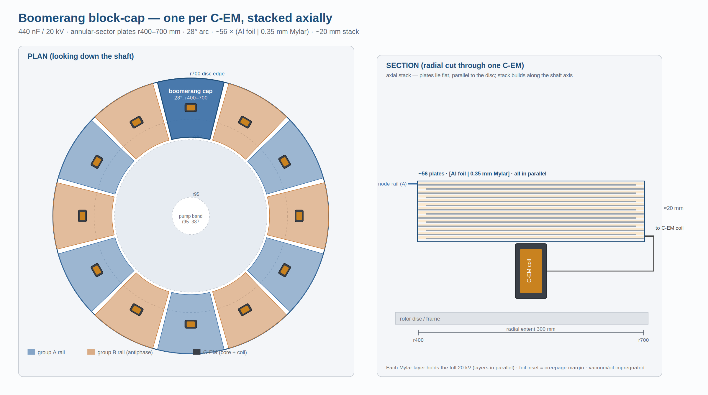

# The Varcap Machine — Design Guide (Formulas & Parameter Dependencies)

> Markdown synthesis of `varcap-machine-design-guide.docx` / `.pdf`, for Claude Code.
> Formulas are LaTeX (`$$…$$`). Figure: `boomerang-cap.svg`.

**Scope.** A formula-first, objective design guide: every subsystem as governing equations, the inverse (target → geometry/thickness), and an explicit map of which parameter sets which.

**Sources & status.** Geometry from DXF `r0.15`; topology from the netlist of record; capacitance and dielectric model from the Block C-I brief; switching from the commutator-design brief; resonator/efficiency/operating point from design-freeze `v0.10` + the S-series. **Current architecture only** — co-rotating rotor halves, split 79 µH coil, 789 pF tank, z 1.334. Superseded choices are not carried. *(Repo-audited against branch `kicad-overlay`: island 648→471 pF single-face primary; reach is multi-fire, M2-PARTIAL; fire window 16.6–21 kV; SG1/SG2 fire the banks into the tank.)*

**Tiers.** `[OC]` standard physics, derivable · `[IR]` engineering choice · `[RH]` heuristic.

**Domain note.** Conventional electrostatic / high-voltage engineering throughout — Bennet doubling, parallel-plate capacitance, Townsend/Paschen breakdown, LC resonance, charge conservation. No substrate/cosmology content enters any formula or choice here.

### How to read this edition (teaching conventions)

This is a **teaching document**. It is organised so the physics can be followed, not merely applied:

- **Every governing relation is numbered** on the right as `(n)`, in one running sequence through the body, in the scientific convention. Definitions, presets and pure numeric results are *not* numbered — only relations you could in principle derive or invert.
- **The body states and uses the formulas; it does not derive them inline.** Each derived relation is worked out in full in **Appendix A**, which is keyed back to the body by equation number (e.g. *“Eq. (33), derived in A.18”*). A derivation always opens by stating the **base equation** it starts from, so the starting point is explicit before any algebra.
- **In-text references use the number, not the prose.** Where a later section needs an earlier result it cites *“Eq. (n)”* rather than restating it. The worked design point (§13) is deliberately written as a chain of equation-number citations so the whole machine can be traced symbol by symbol.
- **Tier tags `[OC]`/`[IR]`/`[RH]`** mark whether a choice is physics, engineering judgement, or heuristic — the derivations in Appendix A exist only for the `[OC]` (derivable) relations; `[IR]`/`[RH]` items are justified by argument, not derivation.

The frozen solver remains the numerical authority for the doubler gain `z` and efficiency `η`; those are **not** re-derived here (see A.0).

---

## 1. Symbols and the parameter dependency map

### 1.1 Symbols (load-bearing names)

Plate separation is `g` (never `d`); rotor angle is `θ`; the swing ratio is `κ_C`. Geometry inputs carry no second UI name.

| Symbol | Quantity | Units |
|---|---|---|
| `ε₀` | vacuum permittivity = 8.8541878128×10⁻¹² | F/m |
| `ε_r` | relative permittivity of the gap medium | — |
| `A_ov(θ)` | facing (overlap) area at rotor angle θ | m² |
| `A_m / A_ring` | kept-sector metal area / central ring area | m² |
| `g` | plate separation (air gap) or solid-dielectric thickness t | m |
| `N_sec / n_kept` | sectors / kept sectors (alternating, n_kept = ⌈N_sec/2⌉) | — |
| `C_max / C_min` | aligned / dis-aligned variable-cap extremes | F |
| `κ_C` | swing ratio C_max/C_min (= solver r₁) | — |
| `z` | doubler per-cycle pump gain (scale-free) | — |
| `η` | net-electrical fraction (1 − equalization tax) | — |
| `f₀ / Z₀ / Q` | tank resonance / characteristic impedance / quality | Hz / Ω / — |
| `E_bd / V_bd` | dielectric strength / breakdown voltage | V/m, V |
| `SF` | safety factor on insulation (design margin) | — |

### 1.2 What sets what

The machine is scale-free in the capacitances: z depends only on capacitance ratios, so absolute size is free and is fixed instead by voltage (breakdown), throughput, and mechanics.

| Parameter | Set by (lever) | Propagates into |
|---|---|---|
| `g_v` (varicap gap) | breakdown, insulate-first: g ≥ V_work·SF / E_bd — Eq. (10) | C scale, fire voltage |
| `r_out` (R387) | C_max target (inverse, Eq. (13)) + rim limit | C_max, rotor diameter, rim speed |
| `A_ring` | swing target: A_ring = A_m / (κ_C − 1) — Eq. (12) | C_min, κ_C |
| `C_max, C_min` | geometry (forward, Eqs. (5)–(6)) | z, throughput |
| `Ca, Cb` | match to C_max (z-band) | z, transfer tax |
| `t_diel` (solid caps) | max(capacitance-driven, breakdown-driven) — Eq. (18) | C, voltage hold |
| `C_R` | full rotor face / septum thickness — Eq. (19) | f₀, Z₀, reach |
| `L_R` | coil geometry (Nagaoka), sized for L_total | f₀, Z₀, node stress |
| `g_SG` (gap) | target fire voltage / breakdown law — Eqs. (34)–(36) | V_fire, recovery time |
| ball radius | cross-fire margin + electrode life (≤17.5 mm @R387) | erosion interval |
| `rpm` | PRF target, bounded by rim + recovery | PRF, rim speed, quench window |

The pump gain depends only on capacitance ratios — the scale-free statement that anchors the whole design:

$$z = z\!\left(\kappa_C,\ \ C_a/C_{\max},\ \ C_{\mathrm{par}}/C_{\min}\right)\qquad[\text{scale-free}] \tag{1}$$

*Scale-free corollary: grow the battery by uniformly scaling the whole capacitance family; scaling one family alone collapses z.* `[OC]` *(Eq. (1) is a structural statement, not a closed form; the value of z is the frozen solver's — see A.0.)*

---

## 2. Variable capacitor: geometry → capacitance (forward)

The sectored-disc varicap is the pump's drive. Two plates on the shaft, the rotor group offset by one sector pitch, give the antiphase pair C1/C2. The capacitance follows the parallel-plate law over the rotation-dependent overlap, with a central ring providing a constant floor.

### 2.1 Base law and overlap

The base equation for the whole capacitor family is the parallel-plate law (derived from Gauss's law in **A.1**):

$$C = \varepsilon_0\,\varepsilon_r\,\frac{A_{\mathrm{ov}}}{g} \tag{2}$$

The rotation enters only through the facing area. Radial sector edges make the overlap linear in angle, giving a triangular fraction (geometry derived in **A.2**):

$$f_{\mathrm{ov}}(\theta) = \left|\,1 - \frac{\theta \bmod 2 s_\theta}{s_\theta}\,\right|,\qquad s_\theta = \frac{360^\circ}{N_{\mathrm{sec}}} \tag{3}$$

f_ov ∈ [0,1], period 2s_θ; θ=0 full overlap, θ=s_θ sectors over gaps. The facing area is the modulated metal plus the constant ring floor (**A.3**):

$$A_{\mathrm{ov}}(\theta) = A_m\,f_{\mathrm{ov}}(\theta) + \chi_{\mathrm{ring}}\,A_{\mathrm{ring}},\qquad \chi_{\mathrm{ring}}\in\{0,1\} \tag{4}$$

`[OC]`

### 2.2 The two extremes the doubler consumes

Only the two phase extremes feed the solver. Evaluating Eq. (2) with Eq. (4) at f_ov = 1 (aligned) and f_ov = 0 (the ring alone, which is azimuthally symmetric and so rotation-independent) gives the extremes and their ratio (**A.4**):

$$C_{\max} = \varepsilon_0\varepsilon_r\,\frac{A_m+\chi A_{\mathrm{ring}}}{g} \tag{5}$$

$$C_{\min} = \varepsilon_0\varepsilon_r\,\frac{\chi A_{\mathrm{ring}}}{g} \tag{6}$$

$$\kappa_C = \frac{C_{\max}}{C_{\min}} = \frac{A_m+\chi A_{\mathrm{ring}}}{\chi A_{\mathrm{ring}}} \tag{7}$$

With the ring off, C_min → 0 and κ_C → ∞ (z blows up); the ring is the **C_min-setting knob** that keeps the swing ratio finite and tunable. `[IR]`

### 2.3 Sector area

For an annulus between r_in and r_out cut into N_sec equal sectors with n_kept kept in alternation, the kept metal area and the ring area are the annulus-area relations (**A.5**, **A.6**):

$$A_m = \frac{n_{\mathrm{kept}}}{N_{\mathrm{sec}}}\,\pi\!\left(r_{\mathrm{out}}^2 - r_{\mathrm{in}}^2\right)\ \ \xrightarrow{\,N_{\mathrm{sec}}=12,\ n_{\mathrm{kept}}=6\,}\ \ A_m = \tfrac{1}{2}\pi\!\left(r_{\mathrm{out}}^2 - r_{\mathrm{in}}^2\right) \tag{8}$$

$$A_{\mathrm{ring}} = \pi\!\left(r_{\mathrm{ring,out}}^2 - r_{\mathrm{ring,in}}^2\right) \tag{9}$$

**Fringing caveat.** Eq. (2) neglects fringing — valid while g ≪ the smallest in-plane feature. Warn if g ≳ 10 % of the smaller of {smallest metal-sector arc width, ring radial width}; otherwise apply a Kirchhoff/Palmer effective-area correction. `[IR]`

---

## 3. Variable capacitor: capacitance → geometry and thickness (inverse)

This is the design direction: given a target C_max, a target swing κ_C, and the working voltage, recover the gap, the metal area, the band radius, and the ring. The ordering is fixed by insulate-first — the gap is a breakdown decision and is solved before the area.

### 3.1 Procedure

1. **Gap from voltage (insulate-first).** The gap must hold the working voltage with margin, independent of the capacitance target. Starting from the breakdown definition V_bd = E_bd·g and requiring V_bd ≥ V_work·SF (**A.7**):

$$g = \frac{V_{\mathrm{work}}\cdot \mathrm{SF}}{E_{\mathrm{bd}}}\qquad\left(\text{air: }E_{\mathrm{bd}}\approx 3.0\ \mathrm{kV/mm}\right) \tag{10}$$

2. **Metal area from the capacitance target.** Invert the C_max law, Eq. (5), for the kept area (**A.8**):

$$A_m = \frac{C_{\max}\,g}{\varepsilon_0\varepsilon_r} - \chi A_{\mathrm{ring}} \tag{11}$$

3. **Ring from the swing target.** Invert the swing ratio, Eq. (7); the ring sets C_min and hence κ_C (**A.8**):

$$A_{\mathrm{ring}} = \frac{A_m}{\chi\,(\kappa_C - 1)} \tag{12}$$

4. **Band radius from the metal area.** Choose an inner radius r_in (mechanical/ring clearance) and invert the sector-area law, Eq. (8), for the outer (**A.9**):

$$r_{\mathrm{out}} = \sqrt{\,r_{\mathrm{in}}^2 + \frac{A_m\,N_{\mathrm{sec}}}{n_{\mathrm{kept}}\,\pi}\,}\ \ \Longrightarrow\ \ \tfrac{1}{2}\text{-kept}:\ \ r_{\mathrm{out}} = \sqrt{\,r_{\mathrm{in}}^2 + \frac{2A_m}{\pi}\,} \tag{13}$$

5. **Check against the limits.** rim speed (§11) caps r_out; the gap and ε_r feed the breakdown/voltage check (§4); fringing (§2.3) caps how small g may be relative to the sector arc.

### 3.2 Closed-form summary

Collecting Eqs. (10)–(13) at the ½-kept geometry:

$$\begin{aligned} g &= \frac{V_{\mathrm{work}}\,\mathrm{SF}}{E_{\mathrm{bd}}} & \qquad A_m &= \frac{C_{\max}\,g}{\varepsilon_0\varepsilon_r} - \chi A_{\mathrm{ring}} \\[4pt] A_{\mathrm{ring}} &= \frac{A_m}{\kappa_C - 1} & \qquad r_{\mathrm{out}} &= \sqrt{\,r_{\mathrm{in}}^2 + \tfrac{2A_m}{\pi}\,} \end{aligned}$$

**Dependency.** C_max and the working voltage together fix g and A_m via Eqs. (10)–(11); κ_C alone fixes the ring via Eq. (12); r_in is the only free mechanical choice, and it trades against r_out in Eq. (13). The swing κ_C is purely an area ratio (Eq. (7)) — independent of g and ε_r, so it survives any later gap or dielectric change.

---

## 4. Dielectric selection and breakdown-limited thickness

### 4.1 Permittivity presets

| Medium | ε_r (nominal) | Model | Note |
|---|---|---|---|
| Vacuum | 1 (exact) | constant | humidity-independent; reference |
| Air | ≈1.0006 | live (T, P, RH) | the only one that genuinely varies |
| Kapton | 3.4 (band 3.0–3.5) | constant | fixed-gap only |
| Mica (muscovite) | 5.4 (band 5.0–7.0) | constant | low-loss precision staple |
| Garolite (G-10/FR4) | ≈4.5–5.0 | constant | structural septum (C_R) |

**Moist-air model.** The relative permittivity of air follows from its optical/RF refractivity N_air (the Smith–Weintraub two-term form), via ε_r = n² ≈ 1 + 2(n−1) (**A.10**):

$$\varepsilon_{r,\mathrm{air}} = 1 + 2\,N_{\mathrm{air}}\times 10^{-6} \tag{14}$$

$$N_{\mathrm{air}} = 77.6\,\frac{P}{T} + 3.73\times 10^{5}\,\frac{p_v}{T^{2}} \tag{15}$$

with T in K, pressures in hPa, `p_v = (RH/100)·p_sat` and `p_sat` from Buck (1981). Dry, 1013 hPa, 273.15 K → ε_r ≈ 1.000576. Air vs vacuum differs <0.1 %, but it is the honest value. `[OC]`

**Rotary realisability.** A rotary varicap moves one plate through the gap medium, so its dielectric is in practice air or vacuum; a solid film cannot be rotated against while bonded to both plates. Solids belong to fixed or sliding-with-film geometries (Ca/Cb/C_R), not the rotating varicap. `[IR]`

### 4.2 Thickness from voltage — and the two regimes

For a solid-dielectric fixed capacitor the gap is the dielectric thickness t. Two independent constraints set it — breakdown (from Eq. (10) with t ≡ g) and capacitance (from Eq. (2) solved for the gap) — and the binding one is the larger (**A.11**):

$$t_{\mathrm{breakdown}} = \frac{V_{\mathrm{work}}\cdot\mathrm{SF}}{E_{\mathrm{diel}}} \tag{16}$$

$$t_{\mathrm{capacitance}} = \frac{\varepsilon_0\varepsilon_r A}{C_{\mathrm{target}}} \tag{17}$$

$$t = \max\!\left(t_{\mathrm{breakdown}},\ t_{\mathrm{capacitance}}\right) \tag{18}$$

Which regime binds depends on the part:

- **C_R (tank) is capacitance-driven.** The full rotor face is large, so hitting 789 pF needs a thick septum: 12 mm garolite. The resulting field is 15 kV / 12 mm = 1.25 kV/mm — far under the ~5 kV/mm derated strength. Breakdown is not the lever here; the capacitance target (Eq. (17)) is.
- **Air-gap varicaps (C1/C2) are breakdown-driven.** The 7 mm air gap is set by Eq. (10)/(16) to hold ~21 kV at 3 kV/mm; the area is then solved for the C target (Eq. (11)).
- **Ca/Cb (transfer) — check both.** 4.5 mm mica for 309 pF; verify it also clears V_work·SF/E_mica (Eq. (16)).

**Void-in-solid caution.** A solid dielectric in series with an unavoidable air gap concentrates field in the air (the air sees the larger field because its ε_r is lower), which can lower the assembly breakdown below either material alone. Solid dielectric is therefore not a max-voltage lever; the levers are gap geometry, creepage ribs, and moving toward gas or vacuum insulation. `[OC]`

---

## 5. Fixed capacitors — transfer (Ca/Cb) and tank (C_R)

**Transfer caps Ca/Cb** are sized by the doubler match, not by geometry first: z peaks when the transfer cap is comparable to C_max. The Block C-I area law (Eq. (2)) then gives the electrode area for the chosen mica thickness. Locked value: 309 pF, 4.5 mm mica. `[IR]`

**Tank C_R** is the rotor-to-rotor capacitance across the central septum, on the full r387 face (not the squeezed active band). It is sized for the resonance target with L_R (§8), and its thickness is capacitance-driven (Eq. (18)). Applying the base law Eq. (2) to the full half-annulus face (**A.12**):

$$C_R = \varepsilon_0\,\varepsilon_{r,\mathrm{garolite}}\,\frac{A_{\mathrm{full}}}{t_{\mathrm{septum}}},\qquad A_{\mathrm{full}} = \tfrac{1}{2}\pi\,r_{387}^{\,2}\ \ \text{(half-annulus face)} \tag{19}$$

Locked value: 789 pF, 12 mm garolite. `[OC]`

**Active vs full face — keep them separate.** The pump caps use the squeezed active band (R95–R387); C_R and f₀ use the full face. The two areas are not interchangeable: the squeeze shrinks only the pump.

---

## 6. Design ratios — the capacitance ladder and the electrode-area ladder

The machine is scale-free in the capacitances (§7): only ratios set the pump, so the design is naturally expressed as a ladder anchored to one capacitor. The natural anchor is the rotor's own variable capacitance — **C_rot = C_max**, the aligned value of C1/C2. Every other capacitor is then a multiple of it. But a ratio is dimensionless and the build is not: each capacitor becomes a physical, steel-electrode plate whose area is fixed by its capacitance **and** its dielectric and separation.

### 6.1 The capacitance ladder (anchored to the rotor cap)

| Capacitor | Value | Dielectric · gap | ÷ C_rot |
|---|---|---|---|
| `C_min` (C1/C2 dis-aligned) | 16 pF | 7.0 mm air | 0.06 |
| **`C_rot = C_max`** (C1/C2 aligned) | **280 pF** | **7.0 mm air** | **1.00 (anchor)** |
| `Ca / Cb` (transfer) | 309 pF | 4.5 mm mica | 1.10 |
| `Cx,max` (flying bucket) | 471 pF | 3.0 mm air + 0.3 mm mica | 1.68 |
| `C_R` (tank) | 789 pF | 12 mm garolite | 2.82 |
| **`C_blk`** (C-magnet DC-block) | **440 nF** | **film / mica, 20 kV** | **1571** |
| per-group bank (6 × C_blk) | 2.64 µF | — | 9429 |

**The ladder spans pF to µF.** The pump caps cluster within ~3× of the rotor cap; the C-magnet DC-block caps stand three orders of magnitude above everything else. That single fact dominates the material budget (§6.4–6.5). Cx,max is the validated single-face **471 pF**; the 648 pF dual-face reading needs a second pickup electrode — a deferred TMD hardware call (dxf_flags.md). `[OC]`

### 6.2 Why each ratio is what it is

- **κ_C = C_max/C_min ≈ 17.5 — the swing.** Set by the central ring area (Eq. (7)); fixes the pump's modulation depth and must keep z inside [1.20, 1.45].
- **Ca/C_rot ≈ 1.10 — the transfer match.** z peaks when the transfer cap is comparable to C_max; this near-unity ratio is a z-band choice, not free.
- **Cx,max/C_R ≈ 0.60 — the dump match.** The flying-bucket cap is sized close to the tank so the island dump η_M2 = 4·Cx·C_R/(Cx+C_R)² ≈ 0.94 (Eq. (33), §8.1). Cx,max/C_rot ≈ 1.68 follows from that match, not from the pump.
- **C_R/C_rot ≈ 2.8 — the tank.** Fixed by the resonance target with L_R and by the full-face geometry (Eq. (19)); sets the reach ½·C_R·V² (Eq. (32)), independent of the pump gain.
- **C_blk/C_rot ≈ 1571 — the motor DC-block.** Sized by the motor branch, not the pump: it must pass the low-frequency stepping drive at minimum impedance while blocking the kV bias and staying a high-Z spectator at f₀. That forces nF, hence the 1500× jump. `[IR]`

### 6.3 Capacitance → steel: the area law

A ratio becomes a plate area only through the dielectric and the gap. Inverting the base law Eq. (2) for the area (**A.13**):

$$A = \frac{C\,g}{\varepsilon_0\,\varepsilon_r} \tag{20}$$

So the area ratio between any two capacitors is the capacitance ratio scaled by their gap and dielectric (**A.13**):

$$\frac{A_i}{A_j} = \frac{C_i}{C_j}\cdot\frac{g_i}{g_j}\cdot\frac{\varepsilon_{r,j}}{\varepsilon_{r,i}} \tag{21}$$

This is why the capacitance ladder and the steel ladder are not the same ladder: a high-ε_r, thin dielectric (mica) buys a large capacitance on a small plate, while an air gap spends plate area. The dielectric and separation are the conversion factors. `[OC]`

### 6.4 The electrode-area ladder (what actually dominates)

Applying the area law Eq. (20) at each capacitor's own dielectric and gap, normalised to the rotor plate (½π(R387²−R95²) = 0.221 m²):

| Capacitor | Value | g/ε_r (mm) | Steel area (m²) | ÷ rotor plate |
|---|---|---|---|---|
| **`C_rot` (C_max)** | **280 pF** | **7.0** | **0.221** | **1.00** |
| `Ca / Cb` | 309 pF | 0.83 | 0.029 | 0.13 |
| `Cx,max` | 471 pF | 3.11 | 0.165 | 0.75 |
| `C_R` | 789 pF | 2.55 | 0.228 | 1.03 |
| **`C_blk`** (each, PP-film) | **440 nF** | **0.036** | **1.81** | **8.2** |
| **`C_blk` × 12** | **5.3 µF** | **—** | **21.7** | **98** |

**Mica compacts the transfer caps** (1.10× the capacitance, 0.13× the plate); the air-dielectric pump and bucket caps and the garolite tank all sit near one rotor-plate of steel each (~0.22 m²). The C-magnet DC-block caps are the outlier: even on the most compact feasible film, **one is ~8× the rotor plate and the twelve together are ~22 m² — roughly 50× the entire pump-cap set combined.** The steel (electrode) budget of the machine is, to first order, the DC-block caps. `[OC]`

### 6.5 The magnet caps dominate — and the dielectric is the lever

Because the DC-block caps run at 20 kV, their dielectric cannot be made arbitrarily thin: the thickness is breakdown-limited (Eq. (16)). Substituting the voltage-set thickness Eq. (16) into the area law Eq. (20) gives the plate area directly in terms of the dielectric (**A.14**):

$$A = \frac{C\,V_{\mathrm{work}}\,\mathrm{SF}}{\varepsilon_0\,\varepsilon_r\,E_{\mathrm{bd}}}\qquad\left(\text{voltage-limited: } t = V_{\mathrm{work}}\mathrm{SF}/E_{\mathrm{bd}}\right) \tag{22}$$

So at fixed capacitance and voltage the area scales inversely with the product ε_r·E_bd — the dielectric figure of merit. The stored-energy density at the breakdown field, and the resulting area scaling, give the figure of merit (**A.14**):

$$u = \tfrac{1}{2}\varepsilon_0\varepsilon_r E_{\mathrm{bd}}^{\,2} \tag{23}$$

$$A \propto \frac{1}{\varepsilon_r\,E_{\mathrm{bd}}}\qquad\Rightarrow\qquad \mathrm{FOM} = \varepsilon_r\,E_{\mathrm{bd}} \tag{24}$$

High permittivity alone does not win; mica's high ε_r is offset by its lower breakdown field, and a high-field film beats it:

| Dielectric | ε_r | E_bd (kV/mm) | t_min @20 kV (SF 2) | Area each (m²) | FOM ε_r·E_bd |
|---|---|---|---|---|---|
| Mica | 5.4 | 118 | 0.34 mm | 3.12 | 637 |
| Kapton film | 3.4 | 236 | 0.17 mm | 2.48 | 802 |
| **PP film** | **2.2** | **500** | **0.08 mm** | **1.81** | **1100 (best)** |

The polypropylene film wins on area despite the lowest ε_r, because its breakdown field lets it run thinnest (Eq. (24)). This is also why a 440 nF / 20 kV part is realistically a wound-film capacitor, not a disc-integrated plate: at these areas it is a discrete component, and it is the dominant capacitor mass in the build. (The E_bd and FOM figures here are external dielectric-literature values, not repo-computed.) `[IR]`

### 6.6 Scaling the whole family

Because the pump is scale-free, the ratio ladder is invariant — choose any absolute rotor capacitance and the rest follow. At a fixed dielectric and gap the areas scale linearly with it, directly from Eq. (20) (**A.14**):

$$\text{fixed }(g,\varepsilon_r):\quad A \propto C\quad\Longrightarrow\quad \{C_a,\,C_x,\,C_R,\,C_{\mathrm{blk}}\}\ \text{scale linearly with } C_{\mathrm{rot}} \tag{25}$$

**Two scaling axes.** Either hold the gaps and dielectrics and scale the rotor cap (the whole steel ladder scales ∝ C_rot, preserving every ratio), or hold the areas and trade the gap — but the gap is breakdown-floored (insulate-first, Eq. (10)), so it can only grow, not shrink, at a given voltage. Raising the operating voltage therefore grows every steel area through the thickness floor (Eq. (22)), fastest on the DC-block caps. The rotor cap sets the family; the voltage sets the floor; the dielectric sets how much steel each ratio costs. `[OC]`

### 6.7 C-magnet block cap — boomerang realization and practical design

The 440 nF / 20 kV DC-block cap (§6.1) is realized as an axially-stacked **boomerang** — flat annular-sector plates (Al foil) interleaved with Mylar film, one cap centred on each C-EM in the outer annulus, the stack building along the shaft axis in the C-EM-plus-frame depth. Because the plate area grows with r², reaching out toward the rim makes the stack thin: the fixed template area (set by energy, Eq. (22)) is spread over large plates, so only a few tens of layers are needed.

Sizing follows directly from the voltage-limited template area (Eq. (22)) divided over the sector plates. The total area, the per-layer boomerang sector area, the layer count and the stack height are (**A.15**):

$$A_{\mathrm{total}} = \frac{C\,V_{\mathrm{work}}\,\mathrm{SF}}{\varepsilon_0\,\varepsilon_r\,E_{\mathrm{bd}}} \tag{26}$$

$$A_{\mathrm{boom}} = \tfrac{1}{2}\varphi\,(r_o^{2} - r_i^{2}) \tag{27}$$

$$N = \frac{A_{\mathrm{total}}}{A_{\mathrm{boom}}} \tag{28}$$

$$H = N\,(t_{\mathrm{film}} + t_{\mathrm{foil}}) \tag{29}$$

| Boomerang (r_i–r_o, arc) | Mylar | A_boom | layers N | stack H |
|---|---|---|---|---|
| 400–700 mm, 28° (clear of pump band) | 0.35 mm (57 kV/mm) | 0.081 m² | 68 | 25 mm |
| **300–700 mm, 28°** | **0.35 mm** | **0.098 m²** | **56** | **20 mm** |
| 300–700 mm, 28°, impregnated | 0.25 mm (80 kV/mm) | 0.098 m² | 40 | 11 mm |

Twelve 28° boomerangs leave ~2° gaps ≈ 24 mm of clearance between adjacent stacks — enough to insulate neighbours, which sit on antiphase group rails (full Δ-voltage to each other). Material is unchanged from §6.4 (~5.4 m² per cap); the boomerang only packages it flat and curved. (The boomerang packaging is a proposed mechanical realization, not part of the repo deck.) `[IR]`

**Practical design rules** — these are material/electrical, not geometric, so none appear in the DXF; the first three change the design, the rest are bench-verified:

- **Edge field grading (corona).** A bare foil edge concentrates field and starts corona that erodes the Mylar. Round or anti-corona-border the edges, and grade the stack (outer plates slightly smaller than inner) so the field steps down toward the rim. The triple point — foil/dielectric/impregnant junction — must be buried in solid or oil, never at an air boundary. `[OC]`
- **Impregnation and voids.** A many-layer stack traps air; any void partial-discharges at 20 kV and ladders the PET out. Vacuum-dry then oil- or resin-impregnate, with a defined fill/vent path (an annular sector traps bubbles at the outer arc unless filled from there). This decides sealed-oil-can vs potted-block construction. `[OC]`
- **Series-string voltage sharing.** Treated here as one parallel cap with every layer at the full 20 kV. If instead built as series sub-stacks to ease the per-layer field, stray capacitance to frame skews the sharing and one section hogs the field and fails first — needing grading elements, and any resistor across the block partly defeats the DC-block. Decide parallel-vs-series before the plate count is fixed. `[IR]`
- **Self-resonance / ESL.** The block must be low-impedance at the ~150 Hz drive, but it also sees the f₀ ≈ 637 kHz tank ring and sub-µs spark-gap fire transients. A wide flat stack has real inductance; place the foil tabs so the self-resonant frequency sits clear of f₀, or it stops being a clean block at the one frequency it must isolate. `[OC]`
- **dV/dt and ripple heating.** Fast commutation steps drive AC current through the film every cycle; dielectric loss (tanδ × V_AC × PRF) is real wattage, and PET's tanδ rises with temperature — check against thermal runaway in the sealed stack. Polypropylene is markedly better here (another nudge toward PP if margin is thin). `[OC]`
- **Mechanical.** Stator-mounted is simplest; if any of it rides the rotor it sees centrifugal load — clamp so plates cannot fan out or shift (which changes C and opens voids), and account for differential thermal expansion between foil, film, and frame. `[IR]`
- **Effective area.** Foil tabs and the creepage inset subtract from the geometric sector, so the effective A_boom is smaller and the real layer count runs a few above the clean calc — size with a ~10 mm dead border. `[OC]`
- **Failure mode.** Foil/PET is not self-healing: one defect is a dead short, and a shorted DC-block dumps the coil onto the pump node. Either accept periodic replacement, or use self-clearing metallized-PP segments and re-sum the area at that construction's stress. `[IR]`

---

## 7. The doubler — gain z and efficiency η

The 4-node symmetric Bennet doubler is the engine. Its per-cycle gain z is scale-free — a function only of capacitance ratios, Eq. (1) — so it is the same at any absolute size. **The frozen solver is the authority for z and η; the relations below are the dependency structure, not a re-derivation** (see A.0 for why z is not derived here).

Restating the scale-free structure (Eq. (1)) for reference:

$$z = z\!\left(\kappa_C,\ \ C_a/C_{\max},\ \ C_{\mathrm{par}}/C_{\min}\right)\qquad[\text{scale-free}]$$

$$z = 1.334\ \ (\text{galvanic ceiling})\qquad z \approx 1.307\ \ (\text{648 pF island})\qquad[\text{solver values}]$$

**Efficiency.** η is the useful output over useful + the charge–charge equalization tax. The doubler core converts at η = 0.386. The downstream island transfer is a true sink and recovers its share of the tax, lifting the machine to η ≈ 0.50 (0.518 design-point transfer-chain η; the self-consistent machine η including the multi-fire reach is ≈ 0.48, island-charging). The doubler-core/Ca–Cb share of the tax is the pumping action itself and is not recoverable. `[OC]`

$$\eta_{\mathrm{core}} = 0.386\qquad \eta_{\mathrm{machine}} \approx 0.50\ \ (\text{direct + island sink})\qquad[\text{solver values}]$$

**Band constraint.** Keep z in the validated band [1.20, 1.45]; below it the modulation collapses (κ_C → 1) and the pump dies, which is what the C_min/ring knob (Eq. (7)) and C_par floor guard against.

---

## 8. Resonator — tank, reach, and the island dump

The tank is the rotor-to-rotor C_R rung by a split conical coil (two sized half-coils, fields-aiding k ≈ 0.30, on the two hubs, with C_R at the centre tap). The split shares the fire transient as two smaller drops so each rotor node sees ~17.5 kV rather than ~35 kV. The coil sits ~1000× below the tank in frequency at the pump rate, so pump and ring do not interfere.

The tank resonance and characteristic impedance are the standard series-LC relations (derived from the LC loop equation in **A.16**):

$$f_0 = \frac{1}{2\pi\sqrt{L_R C_R}} \tag{30}$$

$$Z_0 = \sqrt{\frac{L_R}{C_R}} \tag{31}$$

$$\begin{gathered} L_R = 79\ \mu\mathrm{H},\qquad C_R = 789\ \mathrm{pF} \\[3pt] \Longrightarrow\quad f_0 \approx 637\ \mathrm{kHz},\qquad Z_0 \approx 316\ \Omega,\qquad Q \in \{320,\,500,\,900\} \end{gathered}$$

**Coil sizing.** Two naïve 39.5 µH halves aided at k=0.30 give ~102.7 µH (f₀ ≈ 559 kHz), not 79 µH; the halves are sized down so the aided total lands at L_total = 79 µH. Size the per-half inductance from the Nagaoka form for the conical winding, then verify the aided total. `[IR]`

### 8.1 Reach and the island transfer

The tank energy target is the capacitor stored energy, ½CV² (derived from ∫V dq in **A.17**):

$$\text{reach (tank target)} = \tfrac{1}{2}\,C_R\,V^2 \;\approx\; 89\ \mathrm{mJ}\ \ (\text{15 kV},\ 789\ \mathrm{pF}) \tag{32}$$

The island-to-tank energy-transfer efficiency of a lossless two-capacitor (L-coupled) swap is the matched-transfer relation (derived from the LC charge-sharing dynamics in **A.18**):

$$\eta_{M2} = \frac{4\,C_x\,C_R}{(C_x + C_R)^2} \;\approx\; 0.94\ \ (\text{471/789 pF}) \tag{33}$$

**Multi-fire, not single-kick.** With τ_tank ≈ 0.5 ms against ~1.67 ms between kicks the tank does not build resonantly (accumulation ×1.0–1.01), so it stays Q-robust and f₀-independent. But the island-charging co-sim (verdict **M2-PARTIAL**) shows the gap fires mid-collapse at ~70 pF delivering **~14 mJ/fire**, so the 89 mJ tank (Eq. (32)) is reached over **~6–7 fires** (`ISLAND-FIRE-ENERGY = 14 mJ`, `kick-count ≈ 6.5`) — multi-fire, not a single kick. Match C_x to C_R to keep each dump near 0.94 by Eq. (33) (single-face; ~0.99 with a second pickup face). `[OC]`

---

## 9. Spark gaps — design choices

The gaps physically realise the solver's ideal diodes. Direction comes from timing, not from a diode or a trigger: rotor alignment gates a self-break.

### 9.1 Switching principle

**Hybrid: alignment-gated self-break.** Alignment (the minimum-gap instant) sets when breakdown is possible — pure rotor geometry, drift-free and measurable. The self-break sets the firing voltage. Because the firing angle is the intersection of two rotor-deterministic curves (rising source V vs falling gap length), voltage scatter perturbs the level, not the timing, so jitter stays low. `[OC]`

**Rejected alternatives** `[IR]`: a triggered trigatron (too many drifting, unmeasurable variables; temperature drift corrupts a timed instant); diodes / solid-state switches (reverse back-pressure needs exotic parts; gate drive on a slip-ring-free spinning frame).

### 9.2 Gap medium — air vs vacuum

The breakdown law differs by regime; pick the operating side of the Paschen curve deliberately. The air (above-minimum) law is linear in gap; the vacuum law is sub-linear (field emission); the full Paschen relation underlies both (context and Townsend derivation in **A.19**):

$$\text{air (above Paschen min):}\quad V_{\mathrm{bd}} \approx E_{\mathrm{bd}}\,g,\qquad E_{\mathrm{bd}} \approx 3.0\ \mathrm{kV/mm} \tag{34}$$

$$\text{vacuum (field emission):}\quad V_{\mathrm{bd}} \approx K_{\mathrm{vac}}\,g^{0.6}\ \mathrm{kV},\qquad K_{\mathrm{vac}} \approx 60 \tag{35}$$

$$\text{Paschen:}\quad V_{\mathrm{bd}} = f(p\,d),\qquad \text{minimum near } p\,d \approx 0.7\ \mathrm{kPa\cdot mm}\ (\text{air}) \tag{36}$$

- **Air.** Simple, self-healing, but needs active quench (the channel must deionise between pulses) and erodes electrodes; field roughly linear in gap (Eq. (34)).
- **Vacuum.** Windage ≈ 0 (good for the spin-up budget) and the cavity sits below the Paschen minimum so glow is suppressed; breakdown is sub-linear in gap (g^0.6, Eq. (35)), so margin grows slowly with gap. Used for the cavity in the current design.

### 9.3 Electrodes — geometry and material

- **Geometry: spheres / hemispheres.** A uniform-field sphere gap gives a repeatable self-break and is corona-free; sharp tips produce soft, leaky, poorly-timed corona and are rejected for the switching gaps. Smooth large-radius electrodes are used where a soft glow is wanted (governor, backstop).
- **Sizing.** Ball radius is grown with the firing radius for cross-fire margin and electrode life, bounded by the station spacing. At R387 the maximum ball is 17.5 mm (from the radius/overlap trade).
- **Material: tungsten / W-Cu.** Erosion resistance for repetitive duty. Erosion widens the gap over life, so the operating voltage creeps up — but the timing is geometric and unaffected; this sets a maintenance interval, not a failure. `[IR]`

### 9.4 Single vs series (double) gaps

**SG1, SG2** fire the AR/BR transfer banks into the resonator tank (floating/differential — no ground return). **Cross-couples (SG3, SG4)** bridge two stator electrodes over a floating rotor bar — a series double gap with a floating midpoint. The double gap has a less predictable strike (two Paschen curves in series plus the floating-midpoint stray capacitance), which is tolerable precisely because the timing is geometric and the firing level is non-critical. `[IR]`

### 9.5 Self-break statistics and recovery

The probability that a gap holds off (does not back-conduct) over an inter-pulse window is the exponential channel-deionisation law (derived in **A.20**):

$$\text{hold-off recovery} = 1 - e^{-t_{\mathrm{cycle}}/\tau_{\mathrm{rec}}},\qquad T_{\mathrm{strike}} \approx 0.10\ \mu\mathrm{s} \tag{37}$$

$$\tau_{\mathrm{rec}} \in \{\,10\ \mu\mathrm{s},\ \ 100\ \mu\mathrm{s},\ \ 1\ \mathrm{ms}\,\}\qquad[\text{regime bracket}]$$

**Recovery is the binding rate constraint.** At repetition the inter-pulse window must exceed the channel-recovery time, or the gap back-conducts (Eq. (37)). At 3000 rpm the window is ~333 µs; recovery-failure onset is near ~4000 rpm at the pessimistic (1 ms) corner. The thermal recovery of the spark channel — not fast charge recombination — limits repetition rate. Quench by motion (larger firing radius → faster sweep, ionisation spread over more area) plus forced airflow run with the disc's centrifugal pumping; in the vacuum cavity, motion and the low pressure do the work. `[OC]`

### 9.6 The backstop gap

**A second, smaller gap per island** at a later station and a lower threshold (≈0.6× the main strike) catches any misfire the load-return did not clear, bounding the island charge to ≤1.05× one bucket. It is a gap, not a resistor — no galvanic element may span the island — and it adds a small fixed stray (~6 pF) to the C_min sum, which must be carried in the swing budget. `[IR]`

### 9.7 Quench window — the make-or-break

$$\text{arc must extinguish before the varicap polarity reverses}$$

If the channel is still conducting when the source polarity reverses, it back-conducts and dumps the pumped charge. The favourable half is ~30° of rotation; the arc blow-out (µs to sub-ms) must complete inside it. This is the single hardest timing constraint and is verified both in model and on the bench. `[OC]`

---

## 10. Commutation timing and firing stations

Timing is inherited from the varicap sector geometry — there is no separate clock. The C1/C2 antiphase offset, the stroke offset, and the SG3/SG4 firing offset are all one sector pitch (30°). The pulse repetition frequency is the kept-sector count times the revolution rate (derived in **A.21**):

$$\mathrm{PRF} = \left\lceil N_{\mathrm{sec}}/2\right\rceil \frac{\mathrm{rpm}}{60}\quad(\text{per branch});\qquad 6\ \text{cycles/rev at } N_{\mathrm{sec}}=12 \tag{38}$$

Stations (DXF r0.15), conduction pairs {SG1,SG3} and {SG2,SG4}, firing return-leads-then-cross-couple:

| Gap | Role | Station | Path |
|---|---|---|---|
| `SG1` | bank→tank | 3.00° | node 2 → resonator (R-A) |
| `SG2` | bank→tank | 33.00° | node 3 → resonator (R-B) |
| `SG3a` | load | 7.20° | node 1 → island |
| `SG3b` | fire | 16.05° | island → node 3 |
| `SG4a` | load | 37.20° | node 4 → island |
| `SG4b` | fire | 46.05° | island → node 2 |
| `BS3` | backstop | 19.00° | island misfire catch |
| `BS4` | backstop | 49.00° | island misfire catch |

**Radius governs angle, not time.** Pushing the gaps outboard (R387) buys cross-fire margin in angle and a larger usable ball (life), bounded by the island radius (~R350). It does not change the resonant timing. Trade at R387: 2.95° station spacing, 2.07° overlap at a 12 mm ball, 0.88° cross-fire margin, ~115 µs overlap at 3000 rpm. `[OC]`

---

## 11. Mechanical and operating envelope

Rim speed is the rotational kinematics at the outer radius (derived in **A.22**):

$$v = \frac{2\pi\,r_{\mathrm{out}}\,\mathrm{rpm}}{60}\,,\qquad v < 200\ \mathrm{m/s}\ \ (\text{soft }150) \tag{39}$$

**Dependencies.** r_out and rpm trade against the rim limit (Eq. (39)); the rotor runs supercritical (above its first bending critical) so the operating speed is held away from criticals. The cavity is vacuum ≤ 10 Pa: windage ≈ 0 (spin-up budget) and glow suppressed (below Paschen minimum). Parked operating voltage 15 kV; with the v0.10 freeze the fire window is 16.6–21 kV (4.4 kV margin): fire ≥ 16.6 kV delivers 89 mJ at η 99 %, capped near 21 kV by the C1/C2 7 mm air gaps. `[OC]`

---

## 12. Design limits (the binding battery)

A candidate is feasible only inside every limit; the binding constraint is the one with least margin. At the current anchor the machine is **shuttle-strike-bound**.

| Limit | Bound / constant | Anchor margin |
|---|---|---|
| Scale-free z | z ∈ [1.20, 1.45] | z 1.334 → 0.080 |
| Insulate-first | V_bd > V_target 15 kV; garolite 5 kV/mm derated; vacuum V_bd=60·g^0.6 | 39.6/15 kV → 1.64 |
| Tax managed | η ≥ 0.15 | 0.386/0.15 → 1.58 |
| Parasitic floor | C_par ≥ 20 pF | (C_max−C_par)/C_par ≈ 13 |
| Motor matched | output ≤ pump_net; f_res = PRF; f₀ spectator | 3.7/6.2 mJ → 0.40 |
| Mechanical | rim < 200 (soft 150) m/s; vacuum ≤ 10 Pa | 154/200 → 0.23 |
| **Shuttle integrity (binding)** | **island strike < 21 kV ceiling** | **20/21 kV → 0.048** |
| Cross-fire / timing | overlap clears SG3b–BS3; fire window vs spacing | geometry |

---

## 13. Worked design point (R1 / freeze, traced)

A pass through the formulas at the reference point, so the chain C → geometry → voltage → resonance is visible end to end. Each step cites the equation it uses.

1. **Varicap gap (insulate-first), Eq. (10).** `g = 21 kV / 3 kV/mm ≈ 7 mm` air → holds the fire transient.
2. **Metal area for C_max ≈ 280 pF, Eq. (11)** (vacuum-ε, ring floor χA_ring for C_min ≈ 16 pF, Eq. (6)): `A_m = C_max·g/ε₀ − χA_ring`.
3. **Band radius, Eq. (13).** `r_out = √(r_in² + 2A_m/π) → R387` with the R95 inner band (½-kept, 12 sectors).
4. **Swing, Eq. (7).** `κ_C = 280/16 ≈ 17.5`; the ring area sets this floor independently of g and ε_r.
5. **Transfer / gain, Eq. (1).** Ca = Cb = 309 pF matched to C_max → `z = 1.334` (η_core 0.386; machine ≈ 0.50 with the island sink). *(Solver value — A.0.)*
6. **Tank, Eqs. (19), (30)–(31).** `C_R = ε₀ε_r A_full / 12 mm = 789 pF`; with L_R = 79 µH → `f₀ ≈ 637 kHz, Z₀ ≈ 316 Ω`.
7. **Reach, Eqs. (32)–(33).** `½ C_R V² = ½ · 789 pF · (15 kV)² ≈ 89 mJ` reached over ~6–7 island fires (~14 mJ each; M2-PARTIAL); island dump 4·471·789/(471+789)² ≈ 0.94.
8. **Commutation, Eqs. (38), (39), (37).** `PRF = 6 · 3000/60 = 300 Hz`/branch; stations per §10; recovery window ~333 µs > τ_rec; rim 2π·0.49·3000/60 ≈ 154 m/s < 200.

---

*End of guide body. Formulas are the design relations; the frozen solver remains the authority for z and η, and the bench is the final court on the breakdown and quench assumptions. Where the synthesizer's default preset and the validated operating point differ (the 326 vs 637 kHz tank, the 39.5 µH placeholder), this guide states the operating value and flags the gap.*

---

# Appendix A — Full derivations

This appendix derives every numbered `[OC]` relation in the body, in equation order. Each derivation opens with the **base equation** it starts from — the physics it takes as given — then carries the algebra through to the numbered result. `[IR]`/`[RH]` relations are engineering choices and are argued, not derived, in the body; they are not repeated here. Symbols are as defined in §1.1.

## A.0 — Why z (Eq. 1) is not derived here

The doubler gain z and the efficiencies η_core, η_machine are produced by the **frozen 4-node Bennet-doubler solver** (`solveDoubler4`), which is the project's numerical authority and must not be re-implemented or re-derived (project guardrail). What *can* be stated from first principles is the **structure** of Eq. (1): the doubler's charge-update map is a set of linear charge-conservation equations at the four nodes, and each capacitor enters only as a ratio to the others (every node equation is homogeneous of degree zero in the capacitances once divided through by any one of them). Multiplying every capacitance by a common factor λ leaves all node equations unchanged, so the steady-state per-cycle voltage-multiplication z is invariant under C → λC — i.e. z depends only on the ratios (κ_C, C_a/C_max, C_par/C_min). That is the scale-free corollary of §1.2. The *value* (z = 1.334 at the galvanic ceiling) is the solver's fixed point, quoted, not derived.

## A.1 — Parallel-plate capacitance, Eq. (2)

**Base equations.** Gauss's law for the electric displacement, and the definitions of capacitance and potential:

$$\oint \mathbf{D}\cdot d\mathbf{A} = Q_{\mathrm{free}},\qquad \mathbf{D}=\varepsilon_0\varepsilon_r\mathbf{E},\qquad C \equiv \frac{Q}{V},\qquad V=\int \mathbf{E}\cdot d\boldsymbol\ell .$$

**Derivation.** Two parallel conductors of facing area A carry free charge ±Q. Treat the field between them as that of infinite sheets (the fringing-neglect assumption — valid for g ≪ lateral extent, §2.3). The free surface charge density is σ = Q/A. A pillbox Gaussian surface straddling one plate encloses σ·A_pillbox of free charge and sees displacement only on its inner face, so

$$D = \sigma = \frac{Q}{A}\quad\Longrightarrow\quad E = \frac{D}{\varepsilon_0\varepsilon_r} = \frac{Q}{\varepsilon_0\varepsilon_r A}.$$

The field is uniform between the plates, so the potential difference is simply E·g:

$$V = E\,g = \frac{Q\,g}{\varepsilon_0\varepsilon_r A}.$$

Dividing into the definition of capacitance eliminates Q:

$$C = \frac{Q}{V} = \frac{Q}{Q\,g/(\varepsilon_0\varepsilon_r A)} = \varepsilon_0\varepsilon_r\frac{A}{g}. \qquad\blacksquare\ \text{Eq. (2) with } A\to A_{\mathrm{ov}}.$$

The capacitance scales with facing area and inverse gap; this is the producer law the whole guide rests on.

## A.2 — Triangular overlap fraction, Eq. (3)

**Base picture (the stage).** Two coaxial sector sets, each cut into N_sec equal sectors of angular width s_θ = 360°/N_sec (Eq. (3), right). Alternate sectors are kept metal, so on each disc the *kept* sectors are also of width s_θ but spaced 2s_θ apart. At θ = 0 a rotor kept-sector sits exactly over a stator kept-sector → full overlap.

**Derivation.** Two equal-width angular sectors (each width s_θ) whose centres are offset by an angle δ overlap over an arc of width (s_θ − δ) for 0 ≤ δ ≤ s_θ, and not at all for s_θ ≤ δ ≤ 2s_θ. Because area is proportional to subtended angle at fixed radii, the overlap *fraction* is

$$f(\delta) = \frac{s_\theta-\delta}{s_\theta} = 1-\frac{\delta}{s_\theta},\qquad 0\le\delta\le s_\theta .$$

As θ increases past s_θ the rotor kept-sector leaves one stator kept-sector and begins to enter the *next* one (the previously-removed slot), so the overlap rises again with the same slope, returning to 1 at θ = 2s_θ. The pattern is therefore a symmetric triangle of period 2s_θ. Folding θ into one period with θ mod 2s_θ and writing the symmetric triangle as an absolute value:

$$f_{\mathrm{ov}}(\theta) = \left|\,1-\frac{\theta \bmod 2s_\theta}{s_\theta}\,\right|. \qquad\blacksquare\ \text{Eq. (3)}$$

Check: θ = 0 → f = 1 (aligned); θ = s_θ → f = 0 (kept over gap); θ = 2s_θ → f = 1 (next kept sector). The waveform is exactly triangular only for purely radial edges; rounded or skewed edges round the apexes.

## A.3 — Facing area with ring floor, Eq. (4)

**Base equation.** Eq. (2): capacitance is linear in facing area, so areas of independent metal regions add.

**Derivation.** The varicap has two electrically parallel facing regions: the modulated sector band and a central ring. The sector band contributes its full kept area A_m scaled by the instantaneous overlap fraction (Eq. (3)), A_m·f_ov(θ). The ring is azimuthally continuous, so its facing area does not change with rotation; it contributes A_ring when present (χ_ring = 1) and nothing when omitted (χ_ring = 0). Facing areas in parallel sum:

$$A_{\mathrm{ov}}(\theta) = A_m\,f_{\mathrm{ov}}(\theta) + \chi_{\mathrm{ring}}\,A_{\mathrm{ring}}. \qquad\blacksquare\ \text{Eq. (4)}$$

## A.4 — The two extremes and the swing ratio, Eqs. (5)–(7)

**Base equations.** Eq. (2) C = ε₀ε_r A_ov/g, with the facing area Eq. (4).

**Derivation.** Substitute Eq. (4) into Eq. (2):

$$C(\theta) = \varepsilon_0\varepsilon_r\,\frac{A_m f_{\mathrm{ov}}(\theta) + \chi A_{\mathrm{ring}}}{g}.$$

The doubler only ever sees the two phase extremes, where f_ov ∈ {1, 0} (A.2):

- **Aligned (f_ov = 1):**

$$C_{\max} = \varepsilon_0\varepsilon_r\,\frac{A_m + \chi A_{\mathrm{ring}}}{g}. \qquad\text{Eq. (5)}$$

- **Dis-aligned (f_ov = 0):** the modulated band contributes nothing and only the rotation-independent ring remains:

$$C_{\min} = \varepsilon_0\varepsilon_r\,\frac{\chi A_{\mathrm{ring}}}{g}. \qquad\text{Eq. (6)}$$

The swing ratio is their quotient; ε₀, ε_r and g cancel, leaving a pure area ratio:

$$\kappa_C = \frac{C_{\max}}{C_{\min}} = \frac{A_m + \chi A_{\mathrm{ring}}}{\chi A_{\mathrm{ring}}} = 1 + \frac{A_m}{\chi A_{\mathrm{ring}}}. \qquad\blacksquare\ \text{Eq. (7)}$$

The cancellation is the load-bearing result: **κ_C is set by geometry alone** and is immune to later gap or dielectric changes (the basis of the §3.2 dependency note). With χ = 0, C_min → 0 and κ_C → ∞.

## A.5 — Kept-sector metal area, Eq. (8)

**Base equation.** Area of a full annulus, A_annulus = π(r_out² − r_in²) (itself ∫∫ r dr dφ over r∈[r_in,r_out], φ∈[0,2π]).

**Derivation.** Cutting the annulus into N_sec equal angular sectors gives each sector area A_annulus/N_sec. Keeping n_kept of them (alternating) keeps a fraction n_kept/N_sec of the annulus:

$$A_m = \frac{n_{\mathrm{kept}}}{N_{\mathrm{sec}}}\,\pi\!\left(r_{\mathrm{out}}^2-r_{\mathrm{in}}^2\right).$$

For the build (N_sec = 12, n_kept = 6) the fraction is exactly ½:

$$A_m = \tfrac{1}{2}\pi\!\left(r_{\mathrm{out}}^2-r_{\mathrm{in}}^2\right). \qquad\blacksquare\ \text{Eq. (8)}$$

## A.6 — Ring area, Eq. (9)

**Base equation.** Annulus area, as in A.5.

**Derivation.** The central ring is a full (un-sectored) annulus between r_ring,in and r_ring,out, so its area is directly

$$A_{\mathrm{ring}} = \pi\!\left(r_{\mathrm{ring,out}}^2-r_{\mathrm{ring,in}}^2\right). \qquad\blacksquare\ \text{Eq. (9)}$$

## A.7 — Insulate-first gap, Eq. (10)

**Base equations.** The above-minimum air-breakdown law V_bd = E_bd·g (Eq. (34), A.19) and the design margin definition: the gap must withstand the working voltage times a safety factor, V_hold = V_work·SF.

**Derivation.** Insulation-first means the gap is chosen so its breakdown voltage at least equals the required hold-off:

$$V_{\mathrm{bd}} = E_{\mathrm{bd}}\,g \;\ge\; V_{\mathrm{work}}\cdot\mathrm{SF}.$$

The minimum (and hence design) gap is the equality, solved for g:

$$g = \frac{V_{\mathrm{work}}\cdot\mathrm{SF}}{E_{\mathrm{bd}}}. \qquad\blacksquare\ \text{Eq. (10)}$$

Note this is **independent of the capacitance target** — it is a pure breakdown decision, which is why §3.1 solves it before the area. For air, E_bd ≈ 3.0 kV/mm.

## A.8 — Inverse area and inverse ring, Eqs. (11)–(12)

**Base equations.** The forward laws Eq. (5) (C_max) and Eq. (7) (κ_C).

**Derivation of Eq. (11).** Solve Eq. (5) for the kept metal area. Multiply through by g/(ε₀ε_r):

$$\frac{C_{\max}\,g}{\varepsilon_0\varepsilon_r} = A_m + \chi A_{\mathrm{ring}} \quad\Longrightarrow\quad A_m = \frac{C_{\max}\,g}{\varepsilon_0\varepsilon_r} - \chi A_{\mathrm{ring}}. \qquad\text{Eq. (11)}$$

**Derivation of Eq. (12).** From Eq. (7), κ_C − 1 = A_m/(χA_ring). Solve for the ring area:

$$\chi A_{\mathrm{ring}} = \frac{A_m}{\kappa_C-1} \quad\Longrightarrow\quad A_{\mathrm{ring}} = \frac{A_m}{\chi\,(\kappa_C-1)}. \qquad\blacksquare\ \text{Eq. (12)}$$

So the working voltage fixes g (A.7), the C_max target then fixes A_m (Eq. 11), and the swing target fixes the ring (Eq. 12) — the design ordering of §3.1.

## A.9 — Outer band radius, Eq. (13)

**Base equation.** The sector-area law Eq. (8).

**Derivation.** Solve Eq. (8) for r_out². Multiply by N_sec/(n_kept π):

$$r_{\mathrm{out}}^2 - r_{\mathrm{in}}^2 = \frac{A_m\,N_{\mathrm{sec}}}{n_{\mathrm{kept}}\,\pi}\quad\Longrightarrow\quad r_{\mathrm{out}} = \sqrt{\,r_{\mathrm{in}}^2 + \frac{A_m\,N_{\mathrm{sec}}}{n_{\mathrm{kept}}\,\pi}\,}.$$

For the ½-kept geometry (n_kept/N_sec = ½, so N_sec/n_kept = 2):

$$r_{\mathrm{out}} = \sqrt{\,r_{\mathrm{in}}^2 + \frac{2A_m}{\pi}\,}. \qquad\blacksquare\ \text{Eq. (13)}$$

r_in is the free mechanical choice (ring/clearance); r_out follows, and is then capped by the rim-speed limit (Eq. 39).

## A.10 — Moist-air permittivity, Eqs. (14)–(15)

**Base equations.** The relation between relative permittivity and refractive index at the relevant frequency, ε_r = n² (non-magnetic medium), and the Smith–Weintraub empirical refractivity of air,

$$N \equiv (n-1)\times 10^{6} = 77.6\,\frac{P}{T} + 3.73\times 10^{5}\,\frac{p_v}{T^{2}},$$

a two-term fit (dry-air polarizability term + water-vapour permanent-dipole term) with T in K and partial pressures in hPa.

**Derivation.** Air is optically/RF tenuous, so n is very close to 1 and n − 1 = N×10⁻⁶ ≪ 1. Expand ε_r = n² about n = 1:

$$\varepsilon_r = n^2 = \bigl(1+(n-1)\bigr)^2 = 1 + 2(n-1) + (n-1)^2 \approx 1 + 2(n-1),$$

dropping the (n−1)² term (order 10⁻⁸, negligible). Substituting n − 1 = N_air×10⁻⁶:

$$\varepsilon_{r,\mathrm{air}} = 1 + 2\,N_{\mathrm{air}}\times 10^{-6}, \qquad\text{Eq. (14)}$$
$$N_{\mathrm{air}} = 77.6\,\frac{P}{T} + 3.73\times10^{5}\,\frac{p_v}{T^{2}}. \qquad\blacksquare\ \text{Eq. (15)}$$

The vapour partial pressure is p_v = (RH/100)·p_sat with p_sat from the Buck (1981) saturation fit. **Numeric check (dry, P = 1013 hPa, T = 273.15 K, p_v = 0):** N = 77.6·1013/273.15 ≈ 287.8, so ε_r ≈ 1 + 2·287.8×10⁻⁶ ≈ 1.000576, matching §4.1. The water term is what makes air the one preset that genuinely varies with conditions.

## A.11 — Thickness regimes, Eqs. (16)–(18)

**Base equations.** Breakdown/insulate-first (Eq. 10 with the gap identified as the solid thickness, g ≡ t and E_bd → E_diel) and the parallel-plate law (Eq. 2 solved for the gap).

**Derivation.** For a solid-dielectric fixed cap the "gap" is the dielectric thickness t. Two independent floors act:

*Breakdown floor* — the dielectric must hold V_work·SF across its thickness at its own strength E_diel; from Eq. (10),

$$t_{\mathrm{breakdown}} = \frac{V_{\mathrm{work}}\cdot\mathrm{SF}}{E_{\mathrm{diel}}}. \qquad\text{Eq. (16)}$$

*Capacitance floor* — to hit C_target on a plate of area A, invert Eq. (2): C = ε₀ε_r A/t ⇒

$$t_{\mathrm{capacitance}} = \frac{\varepsilon_0\varepsilon_r A}{C_{\mathrm{target}}}. \qquad\text{Eq. (17)}$$

The thickness must satisfy **both** (thin enough fails breakdown; too thin overshoots C), so the binding value is the larger:

$$t = \max\!\left(t_{\mathrm{breakdown}},\,t_{\mathrm{capacitance}}\right). \qquad\blacksquare\ \text{Eq. (18)}$$

Which term wins classifies the part (capacitance-driven C_R vs breakdown-driven air gaps), §4.2.

## A.12 — Tank capacitance, Eq. (19)

**Base equation.** Parallel-plate law Eq. (2).

**Derivation.** The tank C_R is the rotor-to-rotor capacitance across the central garolite septum, using the *full* half-annulus rotor face A_full = ½π r₃₈₇² (not the squeezed pump band), with the septum thickness as the gap. Direct substitution into Eq. (2) with ε_r = ε_r,garolite and g = t_septum:

$$C_R = \varepsilon_0\,\varepsilon_{r,\mathrm{garolite}}\,\frac{A_{\mathrm{full}}}{t_{\mathrm{septum}}},\qquad A_{\mathrm{full}} = \tfrac{1}{2}\pi\,r_{387}^{\,2}. \qquad\blacksquare\ \text{Eq. (19)}$$

The thickness here is capacitance-driven (Eq. 18 picks t_capacitance): 12 mm garolite for 789 pF, well below the breakdown floor.

## A.13 — Electrode-area law and area ratio, Eqs. (20)–(21)

**Base equation.** Parallel-plate law Eq. (2).

**Derivation of Eq. (20).** Solve Eq. (2) for the plate area:

$$C = \varepsilon_0\varepsilon_r\frac{A}{g}\quad\Longrightarrow\quad A = \frac{C\,g}{\varepsilon_0\varepsilon_r}. \qquad\text{Eq. (20)}$$

**Derivation of Eq. (21).** Write Eq. (20) for two capacitors i and j and divide; ε₀ cancels:

$$\frac{A_i}{A_j} = \frac{C_i\,g_i/(\varepsilon_0\varepsilon_{r,i})}{C_j\,g_j/(\varepsilon_0\varepsilon_{r,j})} = \frac{C_i}{C_j}\cdot\frac{g_i}{g_j}\cdot\frac{\varepsilon_{r,j}}{\varepsilon_{r,i}}. \qquad\blacksquare\ \text{Eq. (21)}$$

The capacitance ratio is *scaled* by the gap ratio and the inverse dielectric ratio — which is exactly why a high-ε_r thin dielectric (mica) buys capacitance cheaply in plate area while an air gap spends it (§6.3).

## A.14 — Voltage-limited area, energy density, FOM, and scaling, Eqs. (22)–(25)

**Base equations.** The area law Eq. (20), the breakdown thickness Eq. (16), and the electrostatic energy density u = ½ ε₀ε_r E² (itself from integrating the field energy, u = ∫ E dD = ½ε₀ε_r E²).

**Derivation of Eq. (22).** For a voltage-limited part the thickness is set by breakdown, g = t = V_work·SF/E_bd (Eq. 16). Substitute into the area law Eq. (20):

$$A = \frac{C\,g}{\varepsilon_0\varepsilon_r} = \frac{C}{\varepsilon_0\varepsilon_r}\cdot\frac{V_{\mathrm{work}}\,\mathrm{SF}}{E_{\mathrm{bd}}} = \frac{C\,V_{\mathrm{work}}\,\mathrm{SF}}{\varepsilon_0\varepsilon_r\,E_{\mathrm{bd}}}. \qquad\text{Eq. (22)}$$

**Derivation of Eq. (23).** At the working point the dielectric is driven to (a safe fraction of) its breakdown field; the maximum usable stored-energy density is the field-energy density evaluated at E = E_bd:

$$u = \tfrac{1}{2}\varepsilon_0\varepsilon_r E_{\mathrm{bd}}^{\,2}. \qquad\text{Eq. (23)}$$

**Derivation of Eq. (24).** Hold C, V_work and SF fixed in Eq. (22); everything except ε_r and E_bd is constant, so

$$A \propto \frac{1}{\varepsilon_r\,E_{\mathrm{bd}}}.$$

Minimum plate area is achieved by maximising the denominator, which defines the dielectric figure of merit:

$$\mathrm{FOM} = \varepsilon_r\,E_{\mathrm{bd}}. \qquad\text{Eq. (24)}$$

This is why PP film (low ε_r but very high E_bd) beats mica on area: the product, not ε_r alone, decides. (It also matches the energy view — for fixed C and V the stored energy ½CV² is fixed, and packing it at higher u = ½ε₀ε_r E_bd² needs less volume, hence less area at the breakdown thickness.)

**Derivation of Eq. (25).** Hold the gap and dielectric fixed instead. Then in Eq. (20) the factor g/(ε₀ε_r) is constant, so A ∝ C. Applying to the whole family anchored on C_rot:

$$\text{fixed }(g,\varepsilon_r):\quad A\propto C \;\Longrightarrow\; \{C_a,C_x,C_R,C_{\mathrm{blk}}\}\ \text{scale linearly with } C_{\mathrm{rot}}. \qquad\blacksquare\ \text{Eq. (25)}$$

This is the steel-budget consequence of the scale-free pump (A.0): pick any absolute rotor cap and the whole electrode ladder scales linearly with it, preserving every ratio.

## A.15 — Boomerang stack sizing, Eqs. (26)–(29)

**Base equations.** The voltage-limited template area Eq. (22), the annular-sector area, and simple layer stacking.

**Derivation of Eq. (26).** The total foil area needed for one 440 nF / 20 kV block is just the voltage-limited area of Eq. (22) (re-labelled A_total):

$$A_{\mathrm{total}} = \frac{C\,V_{\mathrm{work}}\,\mathrm{SF}}{\varepsilon_0\varepsilon_r E_{\mathrm{bd}}}. \qquad\text{Eq. (26)}$$

**Derivation of Eq. (27).** One boomerang plate is an annular sector of half-angle... in fact an annular sector subtending angle φ between radii r_i and r_o. Its area is the swept annulus fraction φ/(2π) of the full annulus π(r_o²−r_i²):

$$A_{\mathrm{boom}} = \frac{\varphi}{2\pi}\cdot\pi\!\left(r_o^2-r_i^2\right) = \tfrac{1}{2}\varphi\,(r_o^2-r_i^2)\qquad(\varphi\ \text{in radians}). \qquad\text{Eq. (27)}$$

**Derivation of Eq. (28).** The plates are stacked in parallel, so their areas add to A_total; the layer count is the total divided by the per-plate area:

$$N = \frac{A_{\mathrm{total}}}{A_{\mathrm{boom}}}. \qquad\text{Eq. (28)}$$

**Derivation of Eq. (29).** Each layer adds one film thickness plus one foil thickness to the axial build; N layers give

$$H = N\,(t_{\mathrm{film}}+t_{\mathrm{foil}}). \qquad\blacksquare\ \text{Eq. (29)}$$

Because A_total is fixed by Eq. (26) while A_boom grows with r_o² (Eq. 27), reaching outboard spreads the fixed area over fewer, larger plates → a thinner stack (the §6.7 observation).

## A.16 — Tank resonance and characteristic impedance, Eqs. (30)–(31)

**Base equations.** Kirchhoff's voltage law around a lossless series L–C loop and the element laws v_L = L di/dt, i = dq/dt, v_C = q/C.

**Derivation of Eq. (30).** Around the loop the inductor and capacitor voltages sum to zero:

$$L\frac{di}{dt} + \frac{q}{C} = 0,\qquad i=\frac{dq}{dt}\;\Longrightarrow\; L\frac{d^2q}{dt^2} + \frac{q}{C}=0.$$

This is simple harmonic motion, q̈ + ω₀² q = 0, with

$$\omega_0^2 = \frac{1}{LC}\quad\Longrightarrow\quad \omega_0=\frac{1}{\sqrt{LC}},\qquad f_0=\frac{\omega_0}{2\pi}=\frac{1}{2\pi\sqrt{L_R C_R}}. \qquad\text{Eq. (30)}$$

**Derivation of Eq. (31).** In the ringing solution q(t) = Q cos ω₀t, the peak capacitor voltage is V̂ = Q/C and the peak current is Î = ω₀Q. Their ratio is the characteristic impedance:

$$Z_0 = \frac{\hat V}{\hat I} = \frac{Q/C}{\omega_0 Q} = \frac{1}{\omega_0 C} = \frac{\sqrt{LC}}{C} = \sqrt{\frac{L}{C}} = \sqrt{\frac{L_R}{C_R}}. \qquad\blacksquare\ \text{Eq. (31)}$$

(Equivalently from energy equipartition ½Lβ = ½CV̂² ⇒ V̂/Î = √(L/C).) **Numeric check:** L_R = 79 µH, C_R = 789 pF → f₀ = 1/(2π√(79e-6·789e-12)) ≈ 637 kHz, Z₀ = √(79e-6/789e-12) ≈ 316 Ω, as quoted in §8.

## A.17 — Reach (stored tank energy), Eq. (32)

**Base equations.** The capacitor element law q = C v and the definition of electrical work, W = ∫ v dq.

**Derivation.** Charging a capacitor from 0 to final voltage V, the instantaneous voltage at charge q is v = q/C, and the work to add dq is v dq:

$$E = \int_0^{Q} v\,dq = \int_0^{Q}\frac{q}{C}\,dq = \frac{Q^2}{2C}.$$

Using Q = CV to eliminate Q:

$$E = \frac{(CV)^2}{2C} = \tfrac{1}{2}C V^2 \quad\Longrightarrow\quad \text{reach} = \tfrac{1}{2}C_R V^2. \qquad\blacksquare\ \text{Eq. (32)}$$

**Numeric check:** ½·789 pF·(15 kV)² = ½·789e-12·2.25e8 ≈ 8.9×10⁻² J = 89 mJ, the tank target of §8.1.

## A.18 — Island→tank transfer efficiency, Eq. (33)

**Base equations.** Charge conservation through a lossless inductor coupling two capacitors, the LC loop equation (as in A.16), and the energy law Eq. (32).

**Setup (the stage).** The flying-bucket cap C_x is pre-charged to V₀ (energy ½C_x V₀²) and then connected through the coupling inductor L to the initially-uncharged tank C_R. No resistance: the only loss-free question is how much of C_x's energy lands on C_R at the instant the current returns to zero (peak tank charge), which is where the gap would re-open.

**Derivation.** Let q(t) be the charge that has flowed from C_x into C_R. The voltage driving the loop is the C_x voltage minus the C_R voltage, and it appears across the inductor:

$$L\ddot q = \underbrace{\left(V_0-\frac{q}{C_x}\right)}_{\text{across }C_x} - \underbrace{\frac{q}{C_R}}_{\text{across }C_R} = V_0 - q\left(\frac{1}{C_x}+\frac{1}{C_R}\right).$$

This is SHM in q about the equilibrium charge q_eq where the right side vanishes:

$$q_{\mathrm{eq}} = \frac{V_0}{\frac{1}{C_x}+\frac{1}{C_R}} = V_0\,\frac{C_x C_R}{C_x+C_R}.$$

The motion starts from rest (q = 0, q̇ = 0), so it oscillates symmetrically about q_eq with amplitude q_eq; the peak transferred charge is therefore

$$q_{\max} = 2\,q_{\mathrm{eq}} = 2V_0\,\frac{C_x C_R}{C_x+C_R}.$$

The energy delivered to the tank at that peak (using Eq. 32 in the form E = q²/2C):

$$E_R = \frac{q_{\max}^2}{2C_R} = \frac{1}{2C_R}\left(2V_0\frac{C_x C_R}{C_x+C_R}\right)^2 = \frac{2V_0^2\,C_x^2 C_R}{(C_x+C_R)^2}.$$

Divide by the energy initially on the bucket, E_x = ½C_x V₀²:

$$\eta_{M2} = \frac{E_R}{E_x} = \frac{2V_0^2\,C_x^2 C_R/(C_x+C_R)^2}{\tfrac{1}{2}C_x V_0^2} = \frac{4\,C_x C_R}{(C_x+C_R)^2}. \qquad\blacksquare\ \text{Eq. (33)}$$

**Properties.** η_M2 = 1 exactly when C_x = C_R (perfect matched transfer), and falls off as the mismatch grows — which is why §6.2/§8.1 size C_x close to C_R. **Numeric check:** C_x = 471 pF, C_R = 789 pF → 4·471·789/(471+789)² = 1 486 476/1 587 600 ≈ 0.936 ≈ 0.94. (A second pickup face raising the effective C_x toward C_R pushes it to ~0.99.)

## A.19 — Breakdown laws, Eqs. (34)–(36)

These are the empirical/semi-empirical gas- and vacuum-breakdown laws; they are not first-principles closed forms but are derived/justified as follows.

**Eq. (36) — Paschen (the parent law).** *Base:* Townsend's avalanche criterion γ(e^{αd} − 1) = 1, with the first ionisation coefficient α/p = A·exp(−B p/E) and a uniform field E = V/d. Substituting E = V/d and solving the criterion for the breakdown voltage gives the Paschen form

$$V_{\mathrm{bd}} = \frac{B\,(pd)}{\ln\!\big(A\,pd\big) - \ln\!\big[\ln(1+1/\gamma)\big]},$$

a function of the product pd alone, with a minimum near pd ≈ 0.7 kPa·mm for air. Hence the schematic Eq. (36), V_bd = f(p·d).

**Eq. (34) — air, above the Paschen minimum.** Far to the right of the minimum the logarithmic denominator varies slowly, so V_bd is very nearly proportional to pd; at fixed atmospheric pressure this collapses to a field-times-gap rule with a roughly constant effective strength:

$$V_{\mathrm{bd}} \approx E_{\mathrm{bd}}\,g,\qquad E_{\mathrm{bd}}\approx 3.0\ \mathrm{kV/mm}\ (\text{air, cm-scale gaps}). \qquad\text{Eq. (34)}$$

This is the linear law used for the insulate-first gap (A.7).

**Eq. (35) — vacuum, field-emission regime.** Below the Paschen minimum (and in hard vacuum) gas avalanche is suppressed; breakdown is governed by field emission and microparticle/electrode effects, empirically fitted by the Cranberg-type total-voltage law V_bd ∝ g^p with p ≈ 0.5–0.6 over practical gaps:

$$V_{\mathrm{bd}} \approx K_{\mathrm{vac}}\,g^{0.6}\ \mathrm{kV},\qquad K_{\mathrm{vac}}\approx 60. \qquad\blacksquare\ \text{Eq. (35)}$$

The sub-linear exponent is why vacuum margin grows only slowly with gap (§9.2). These constants are literature/empirical, not repo-derived.

## A.20 — Hold-off recovery, Eq. (37)

**Base picture.** After an arc, the channel's residual ionisation/temperature decays toward the cold (insulating) state with a single dominant time constant τ_rec (thermal recovery of the spark channel). Model the recovered dielectric strength fraction as a first-order relaxation: the un-recovered fraction decays as e^{−t/τ_rec}.

**Derivation.** Let R(t) be the fraction of full hold-off strength recovered a time t after the previous strike. First-order relaxation from 0 toward 1 gives dR/dt = (1 − R)/τ_rec, with R(0) = 0, whose solution is

$$R(t) = 1 - e^{-t/\tau_{\mathrm{rec}}}.$$

Evaluated over one inter-pulse window t = t_cycle:

$$\text{hold-off recovery} = 1 - e^{-t_{\mathrm{cycle}}/\tau_{\mathrm{rec}}}. \qquad\blacksquare\ \text{Eq. (37)}$$

Recovery is near-complete only when t_cycle ≫ τ_rec; if t_cycle ≲ τ_rec the gap re-conducts. With τ_rec bracketed at {10 µs, 100 µs, 1 ms} and the 3000 rpm window ≈ 333 µs, the pessimistic 1 ms corner is the binding rate limit (§9.5). T_strike ≈ 0.10 µs is the (much faster) strike-formation time, quoted for scale.

## A.21 — Pulse repetition frequency, Eq. (38)

**Base picture.** Counting events per revolution. Each kept sector produces one pump cycle (and hence one firing event) per pass; with n_kept = ⌈N_sec/2⌉ kept sectors per branch and rpm/60 revolutions per second:

$$\mathrm{PRF} = n_{\mathrm{kept}}\cdot\frac{\mathrm{rpm}}{60} = \left\lceil \tfrac{N_{\mathrm{sec}}}{2}\right\rceil\frac{\mathrm{rpm}}{60}. \qquad\blacksquare\ \text{Eq. (38)}$$

**Numeric check:** N_sec = 12 → ⌈6⌉ = 6 cycles/rev; at 3000 rpm, PRF = 6·3000/60 = 300 Hz per branch (§13).

## A.22 — Rim speed, Eq. (39)

**Base equations.** Rotational kinematics: tangential speed v = ω r, with angular rate ω = 2π·(rev/s) and rev/s = rpm/60.

**Derivation.**

$$v = \omega\,r_{\mathrm{out}} = 2\pi\Big(\tfrac{\mathrm{rpm}}{60}\Big)r_{\mathrm{out}} = \frac{2\pi\,r_{\mathrm{out}}\,\mathrm{rpm}}{60}. \qquad\blacksquare\ \text{Eq. (39)}$$

**Numeric check:** r_out = 0.49 m, 3000 rpm → v = 2π·0.49·3000/60 ≈ 154 m/s, under the 200 m/s rim limit (soft 150) of §11.

---

*End of Appendix A. Every `[OC]` numbered relation in the body is derived above from a stated base equation; the `[IR]`/`[RH]` relations are engineering choices argued in place. The frozen solver remains the authority for z and η (A.0), and the bench is the final court on the breakdown (A.19) and recovery (A.20) assumptions.*
